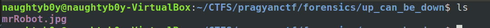
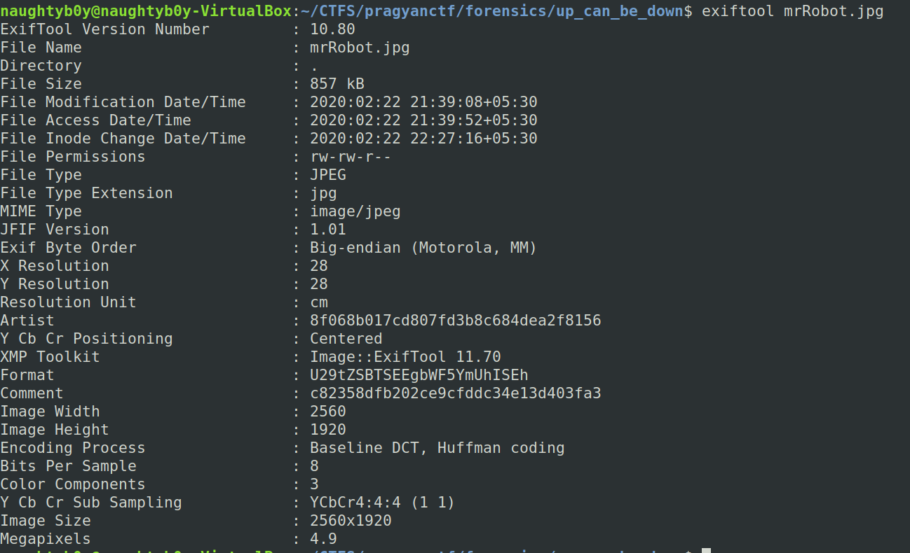
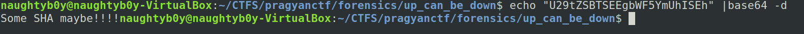
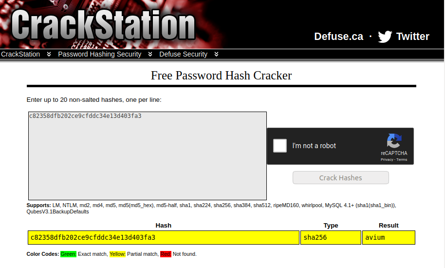
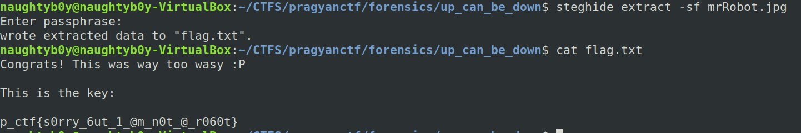

---
title:Pragyan Ctf 2020
published:true
---

## Name-Up_can_be_Down

## Category-Forensics

## Points-100

**Description**=Mr. Robot is being sent to future. But accidently he lost his passkey 
which he needs to activate the Time Machine. But he is smart and had 
already asked Elliot to save the key inside a file to use it in such 
conditions but safely so that others can't retrieve it easily. Can you 
help Mr. Robot to find the secret passkey from the file?


## Solution

So we are provided with a file called mrRobot.txt

 


Running exif tool on the image gives us




we can see that there is a base 64 string in Format value:U29tZSBTSEEgbWF5YmUhISEh


Decoding it gives us the hint to crack the hash 
trying the hash on <https://crackstation.net/>




now trying the key **avium** as passphrase to steghide



so the flag is <br>
```
p_ctf{s0rry_6ut_1_@m_n0t_@_r060t}
```


