So this is a website where you can get man challenges and box that you can root to improve your knowledge.
Today I am going to solve the Advent_Of_Cyber  the 25 days challenge for complete beginners
The link is given below
<https://tryhackme.com/dashboard>
## Day 1(Task 6)
So we are given with a login website and we have to register on it using any credentials you want

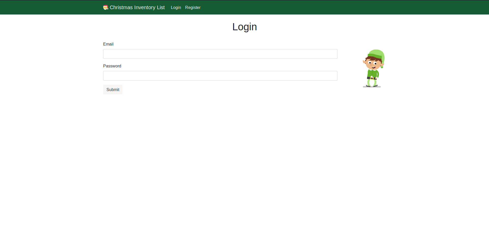


After loggin in we have the following screen inspecting the cookies on the website we have the following results

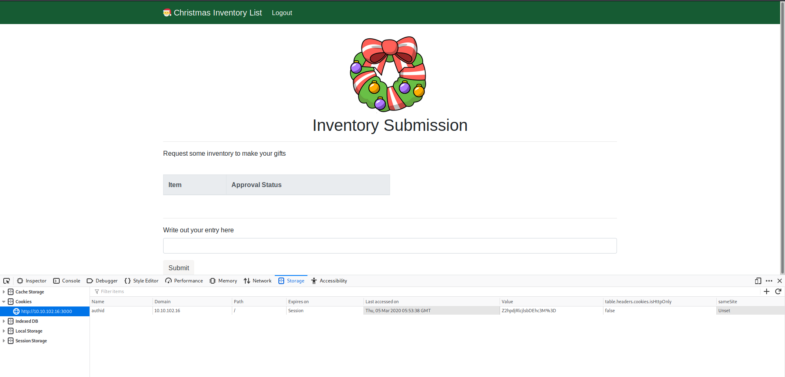

we have an cookie **authid** and it seems to be urlencoded and base64 encoded 

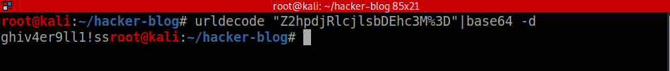

On decoding it we have authid=**ghi##########** 
here the hidden part show the constant part of cookie 

so now we change the user to mcinventory and forge the cookie and inject it into the browser 
authid=*mcinventory##########*

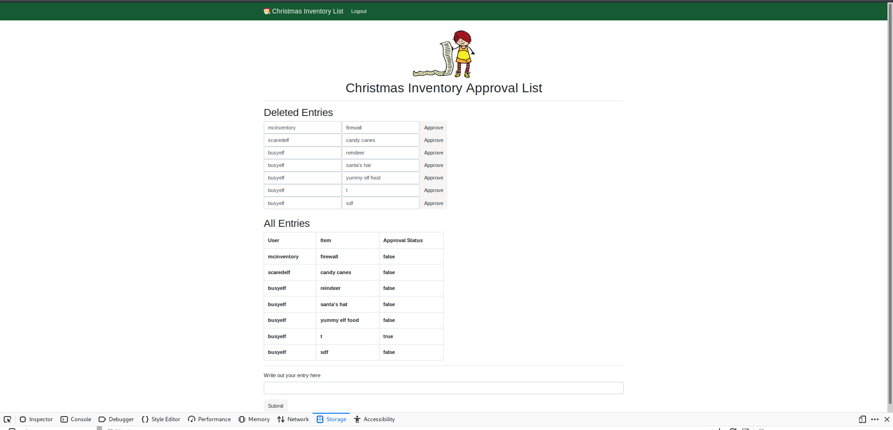

so now we have the answers for Task 6

## Day2(Task 7)

Now we are give a url and we have to find the hidden directries at the given url 
using gobuster for the job 

```bash
gobuster -u http://<ur-machine-ip>:3000 -w /usr/share/dirb/common.txt
```

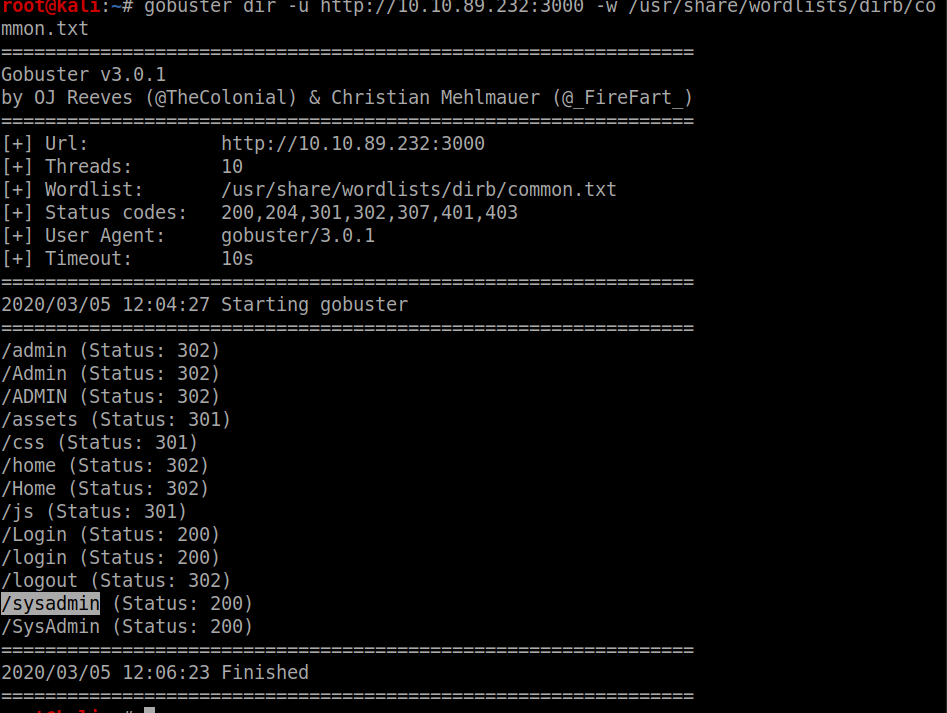

now on to the directory we get a admin login page 
looking at the source we have 

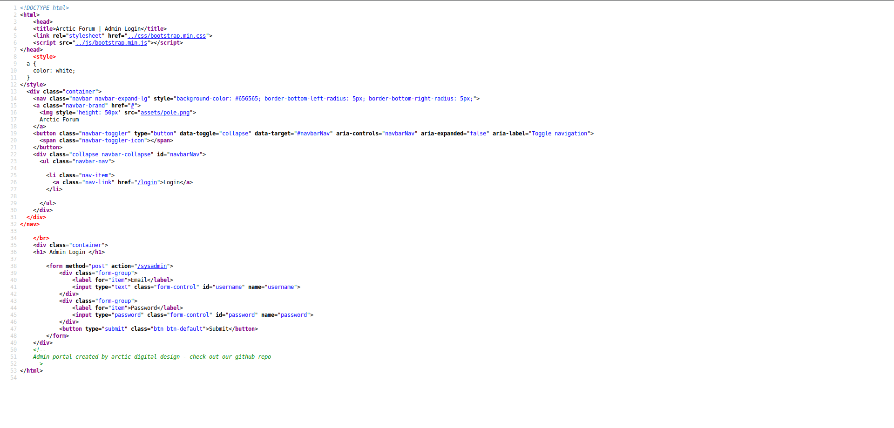

searching for the repository on github

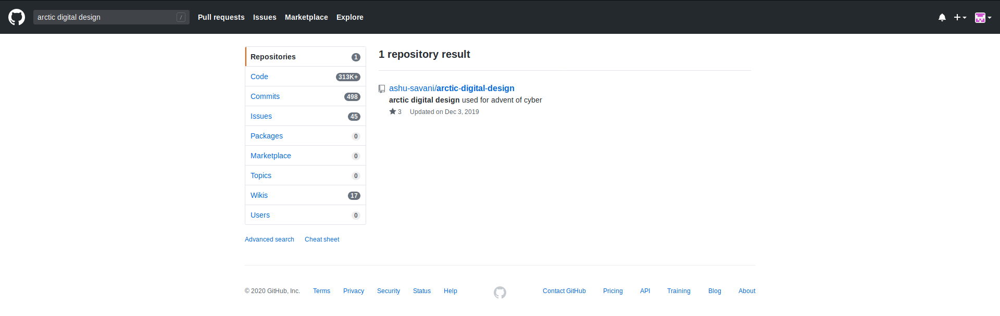

now entering the default creds


And We have successfully completed the task :)

## Day3(Task 8)
This is a forensics challenge we have to basically just answer the questions on the site by looking at the pcap file
### For ques 1

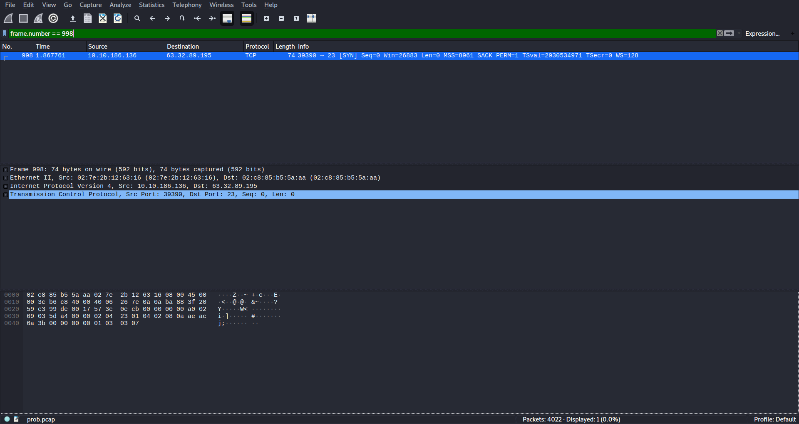

###for ques 2

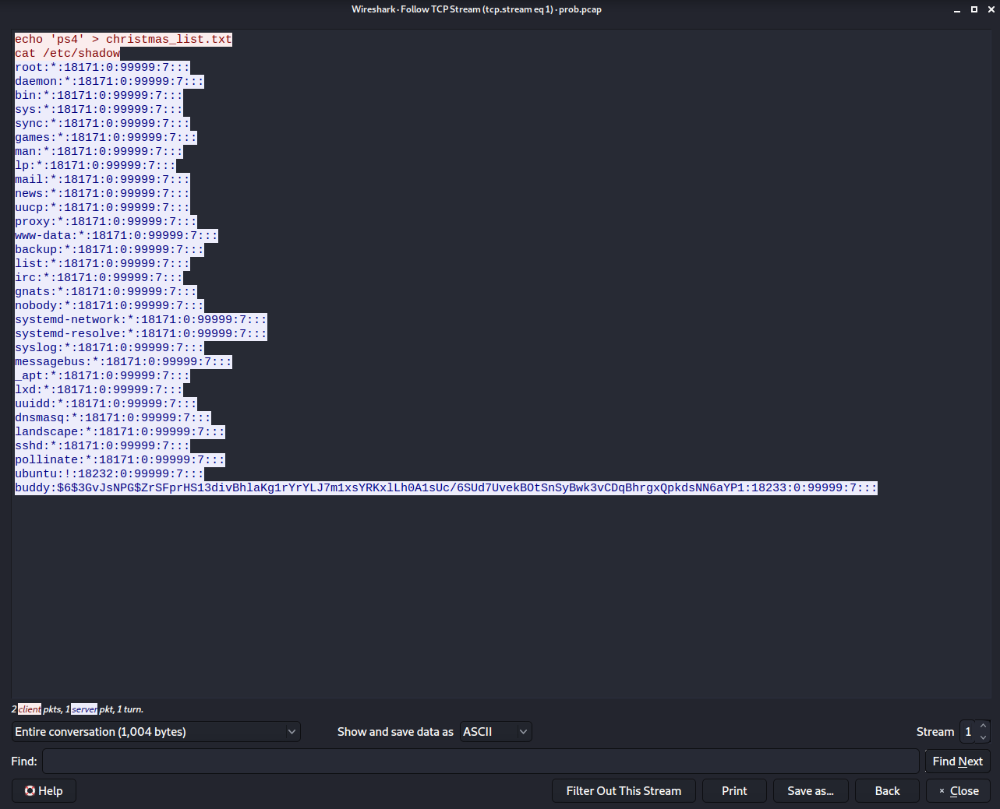

###for ques 3
we have to save the hash found in the output above and crack the hash with hashcat using rockyou.txt as given in the hint 

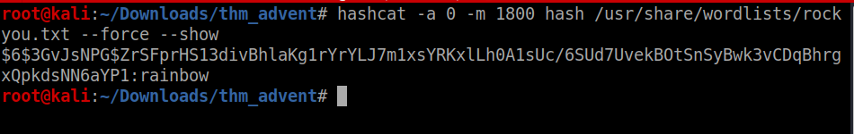


One more Day complete :)

## Day4(Task 9)

This task is about basic understanding of linux and moving around in linux

### ques 1
to see number of visible files  **serioulsy :(**

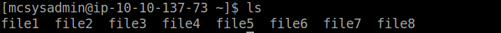

### ques 2
use cat to see the contest *EzPz*

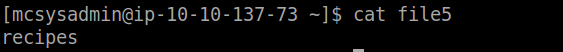

### ques 3
```bash 
grep -r password
```
using the command about the grep *recursively*
this help us save time rather that perform grep on each file

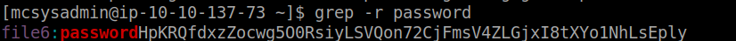

### ques 4
```bash
grep -r '[0-9]\{1,3\}\.[0-9]\{1,3\}\.[0-9]\{1,3\}\.[0-9]\{1,3\}'
```
here using a regex string we can easily carve out the IP address

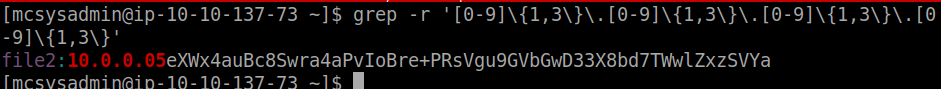

### ques 5
```bash
cat /etc/passwd |grep /bin/bash
```
using this we can see how many users have shell access to the machine

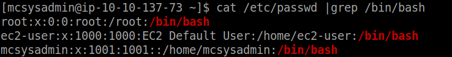

### ques 6
```bash
sha1sum file8
```
using the **sha1sum** command to get the hash

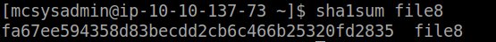


### ques 7
Since we don't have permissions to read /etc/shadow file 
so we find other files having string shadow in it and to which we have permission to read 
```bash
find / -name "*shadow*" 2>/dev/null
```

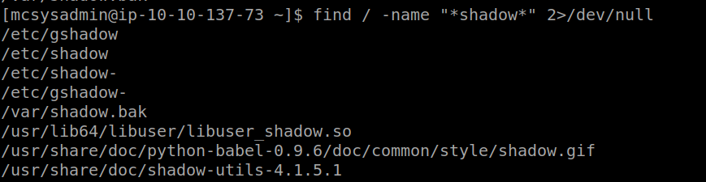

we get an interesting shadow.bak file which we can so reading it we find the mcsysadmin's password hash


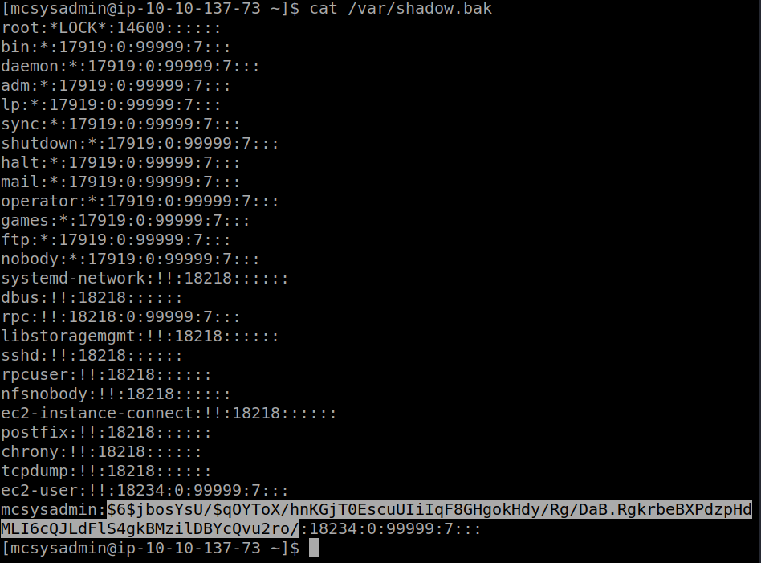


## Day5(Task 10)
This is standard **OSINT** introductory challenge

we are given with an jpeg image running exiftool on it gets us the username as the creator tag in exiftool output


Now using any osint username finder try to find the link to username accounts

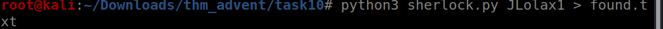


We got the username 

Lets checkout the twitter account with the found username


We get the answers to the first three questions :)

now lets go to the wordpress site linked in the description

There was a mention of wayback machine in the hints section lets look at the results of wayback machine

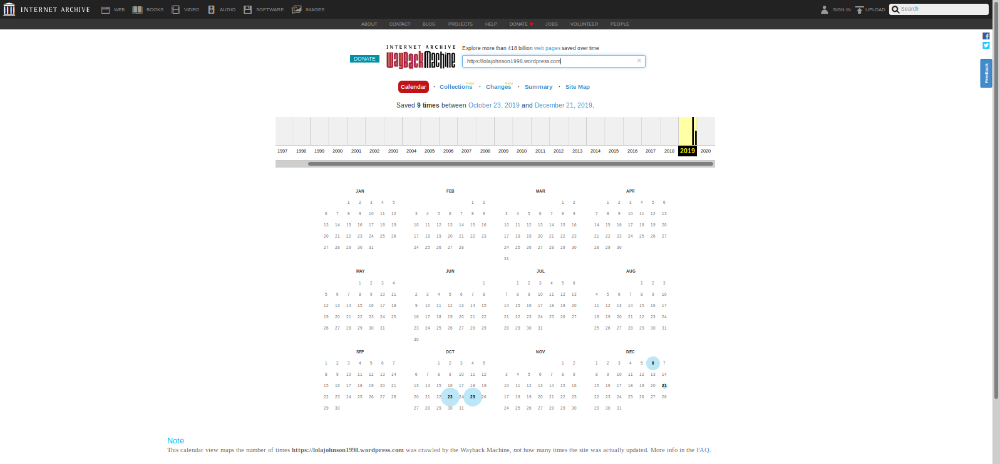


lets check the oldest snapshot of the website we get the answers to other to question by viewing the oldest version of this website

## Day6(Task 11)
We are given a pcap file and asked some questions about the data in the pcap 

### ques 1

here on following through the udp  streams we get a a string that seems to encoded so we decode it to get the answer

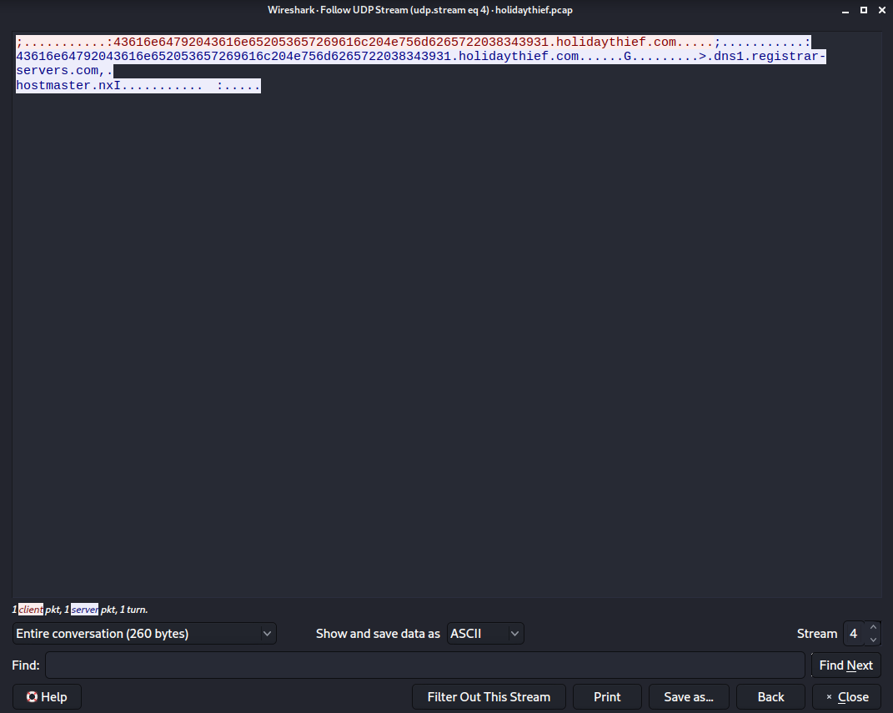

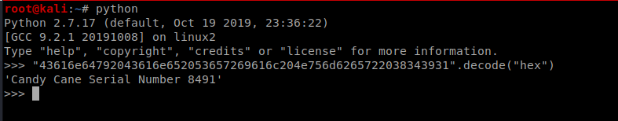


### ques 2

Looking through the http request we see that there is a zip file and a jpeg image so we export them from wireshark
 
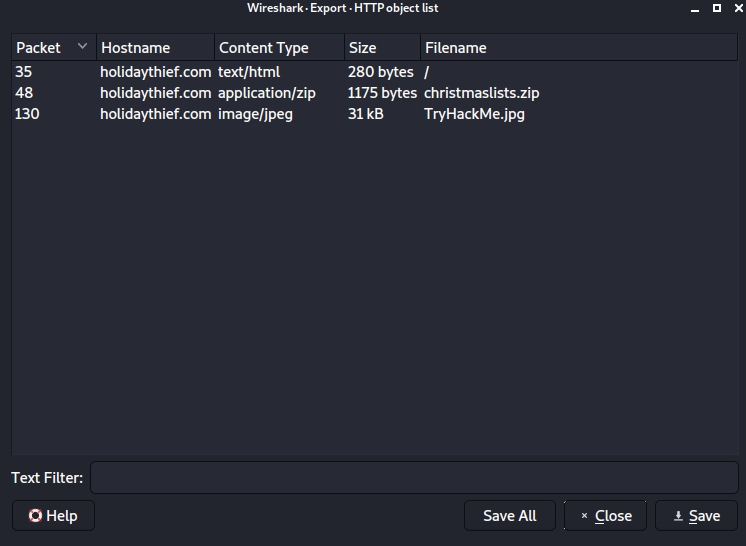

We can use **steghide** with empty password to get the data from jpeg file

### ques 3

we can use **John** to crack the password of zip file 

