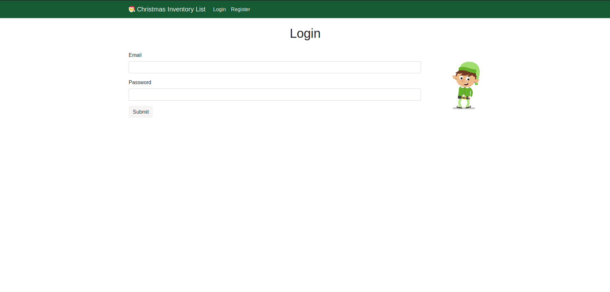
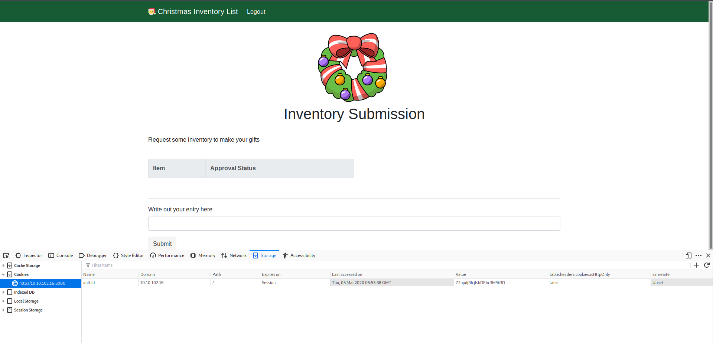
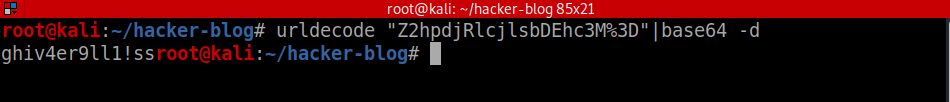
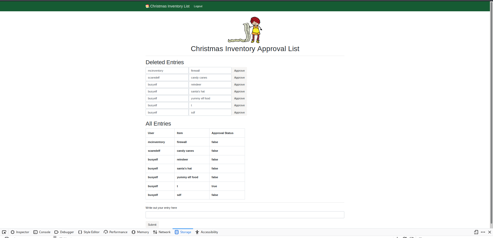
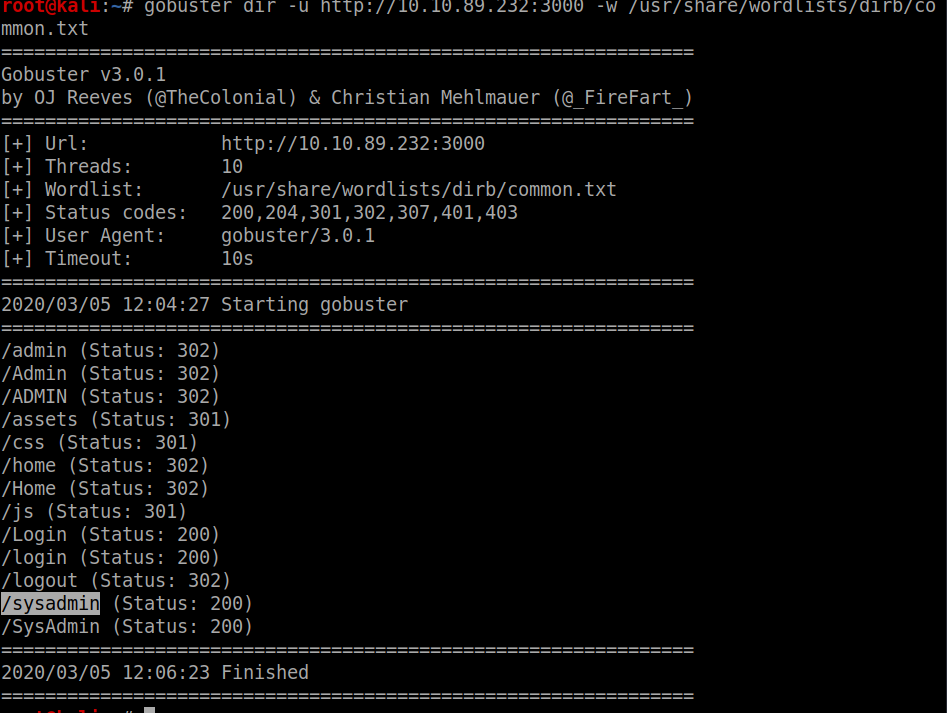

# TryHackme

So this is a website where you can get man challenges and box that you can root to improve your knowledge.
Today I am going to solve the Advent_Of_Cyber  the 25 days challenge for complete beginners

## Day 1(Task 6)
So we are given with a login website and we have to register on it using any credentials you want




After loggin in we have the following screen inspecting the cookies on the website we have the following results



we have an cookie **authid** and it seems to be urlencoded and base64 encoded 



On decoding it we have authid=**ghi##########** 
here the hidden part show the constant part of cookie 

so now we change the user to mcinventory and forge the cookie and inject it into the browser 
authid=*mcinventory##########*



so now we have the answers for Task 6

## Day2(Task 7)

Now we are give a url and we have to find the hidden directries at the given url 
using gobuster for the job 

```bash
gobuster -u http://<ur-machine-ip>:3000 -w /usr/share/dirb/common.txt
```



now on to the directory we get a admin login page 
looking at the source we have 


searching for the repository on github


now entering the default creds


And We have successfully completed the task :)


