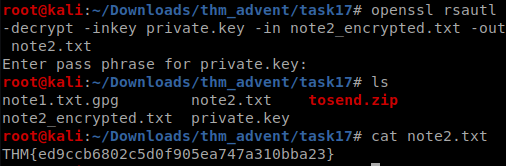

So this is the continuation to the Advent_of_Cyber 25 part Series on <https://tryhackme.com>

## Day7(Task 12)
here we have to do a nmap scan on the given ip and answer some question based on the scan results **So_Ezzzz**

I used the following command
```bash
nmap -v -sT -A  10.10.231.143
```
some part of the log results are given below 


we see a http server on port **999**
we access it on our browser to get the answer to the last question


## Day8(Task 13)
So I have to find the port on which ssh is running on so I use the following command

```bash
nmap -v -p- --min-parallelism 100  10.10.159.75
```
we get the port 65534 open and further scan reveals that it is running ssh


lets ssh into it 
we now use the following command to find **SUID** file with user root as the name of the challenge suggest 
we use the command

```bash
find / -user root -perm -4000 -print 2>/dev/null
```


now the system-control binary looks interesting,on checking it out we find that it executes any command we supply as root so we can get both the flags using this binary


***hackerman!!!***

## Day9(Task 14)
This is a simple scripting task we just have to write a script to find the **value** by using *requests* and *json* module in python

```python
import requests
import json

path="f"
host="http://10.10.241.214:3000/"
value=""

while 1==1:
	response=requests.get(host+path)
	# print(response.text)
	json_data=json.loads(response.text)
	path=json_data["next"]
	if path=="end":
		break
	value=value+json_data["value"]
	# print(value)

print(value)
```
On running the script we get the flag

## Day10(Task 15)

So this is basically intro to the metasploit framework

lets start by basic nmap scans


now running nikto to find the vulnerablity in the web server


so we got a strut vulnerablity from nikto lets search for it in msfconsole


configuring the exploit in the msfconsole and running it


now finding the flag using basic regex


and ssh pass from bash_history 


now logging into ssh using the credentials and finding the asked info


## Day11(Task 16)
This Challenge introduces us to the basic file transfer and database service
First of lets nmap scan the ip 


### Task 1
Here we have to read creds.txt from nfs of the server


### Task 2 
Here we login using creds as **anonymous:anonymous**
and get the desired file


### Task 3
Now login in to mysql database using the credentials found and look for useful data


The task is Done *:)))*

## Day12(Task 17)

So in this challenge we are given a zip file, on unzipping it we find the following


### ques 1
we need to find the md5sum of note1 file which can be done easily in the terminal :smile:


### ques 2
we need to decrypt the gpg file and we are given the passphrase as **25daysofchristmas**


### ques 3 
we need to decrypt an encrypted text file using the given private rsa key 
here google comes to my rescue we need to use *openssl rsautl*

