# So this is my first box so there may be some mistakes :)
the link to the box 
<https://www.vulnhub.com/entry/rickdiculouslyeasy-1,207/>

Lets start with *netsdicover*
I got the IP of box as **192.168.243.4**
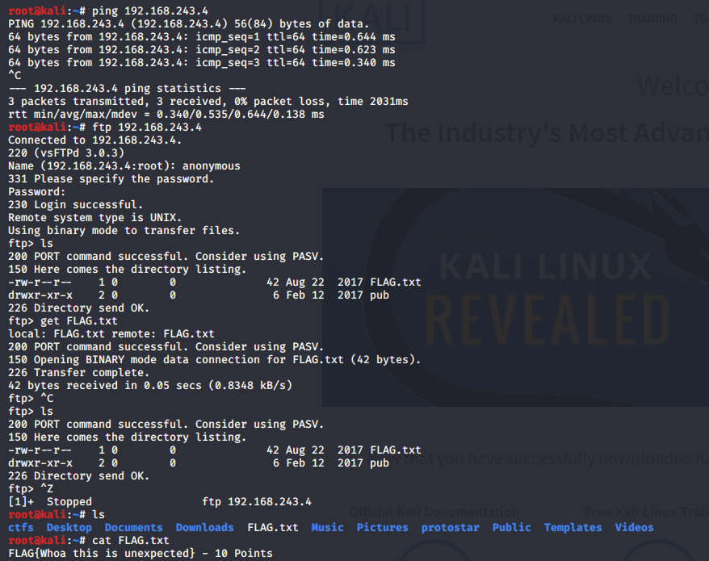 

I thought that there may be a ftp service running as I read about it some of the other boxes writups
And yeah there is a flag 

**flag-1**
```
FLAG{Whoa this is unexpected} - 10 points
```
***points=10/130***

The nmap scan results are
```text
Starting Nmap 7.80 ( https://nmap.org ) at 2020-03-06 21:06 IST
Nmap scan report for 192.168.243.4
Host is up (0.00032s latency).
Not shown: 65528 closed ports
PORT      STATE SERVICE    VERSION
21/tcp    open  ftp        vsftpd 3.0.3
| ftp-anon: Anonymous FTP login allowed (FTP code 230)
| -rw-r--r--    1 0        0              42 Aug 22  2017 FLAG.txt
|_drwxr-xr-x    2 0        0               6 Feb 12  2017 pub
| ftp-syst: 
|   STAT: 
| FTP server status:
|      Connected to ::ffff:192.168.243.3
|      Logged in as ftp
|      TYPE: ASCII
|      No session bandwidth limit
|      Session timeout in seconds is 300
|      Control connection is plain text
|      Data connections will be plain text
|      At session startup, client count was 1
|      vsFTPd 3.0.3 - secure, fast, stable
|_End of status
22/tcp    open  ssh?
| fingerprint-strings: 
|   NULL: 
|_    Welcome to Ubuntu 14.04.5 LTS (GNU/Linux 4.4.0-31-generic x86_64)
|_ssh-hostkey: ERROR: Script execution failed (use -d to debug)
80/tcp    open  http       Apache httpd 2.4.27 ((Fedora))
| http-methods: 
|_  Potentially risky methods: TRACE
|_http-server-header: Apache/2.4.27 (Fedora)
|_http-title: Morty's Website
9090/tcp  open  http       Cockpit web service
|_http-title: Did not follow redirect to https://192.168.243.4:9090/
13337/tcp open  unknown
| fingerprint-strings: 
|   NULL: 
|_    FLAG:{TheyFoundMyBackDoorMorty}-10Points
22222/tcp open  ssh        OpenSSH 7.5 (protocol 2.0)
| ssh-hostkey: 
|   2048 b4:11:56:7f:c0:36:96:7c:d0:99:dd:53:95:22:97:4f (RSA)
|   256 20:67:ed:d9:39:88:f9:ed:0d:af:8c:8e:8a:45:6e:0e (ECDSA)
|_  256 a6:84:fa:0f:df:e0:dc:e2:9a:2d:e7:13:3c:e7:50:a9 (ED25519)
60000/tcp open  tcpwrapped
2 services unrecognized despite returning data. If you know the service/version, please submit the following fingerprints at https://nmap.org/cgi-bin/submit.cgi?new-service :
==============NEXT SERVICE FINGERPRINT (SUBMIT INDIVIDUALLY)==============
SF-Port22-TCP:V=7.80%I=7%D=3/6%Time=5E626E02%P=x86_64-pc-linux-gnu%r(NULL,
SF:42,"Welcome\x20to\x20Ubuntu\x2014\.04\.5\x20LTS\x20\(GNU/Linux\x204\.4\
SF:.0-31-generic\x20x86_64\)\n");
==============NEXT SERVICE FINGERPRINT (SUBMIT INDIVIDUALLY)==============
SF-Port13337-TCP:V=7.80%I=7%D=3/6%Time=5E626E02%P=x86_64-pc-linux-gnu%r(NU
SF:LL,29,"FLAG:{TheyFoundMyBackDoorMorty}-10Points\n");
MAC Address: 08:00:27:BF:52:95 (Oracle VirtualBox virtual NIC)
Device type: general purpose
Running: Linux 3.X|4.X
OS CPE: cpe:/o:linux:linux_kernel:3 cpe:/o:linux:linux_kernel:4
OS details: Linux 3.2 - 4.9
Network Distance: 1 hop
Service Info: OSs: Unix, Linux; CPE: cpe:/o:linux:linux_kernel

OS and Service detection performed. Please report any incorrect results at https://nmap.org/submit/ .
Nmap done: 1 IP address (1 host up) scanned in 55.73 seconds
```
We can see that ports 21,22,80,9090,13337,22222,60000 are open and we found another flag in the scan itself

**flag-2**
```
FLAG{TheyFoundMyBackDoorMorty} - 10 points
```
***points=20/130***

next I ran nikto to get the hidden directories in the IP address

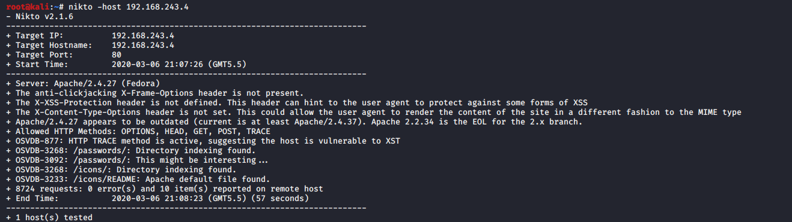 

And yes there was a */passwords* directory present 
checking it out gives the 3rd flag

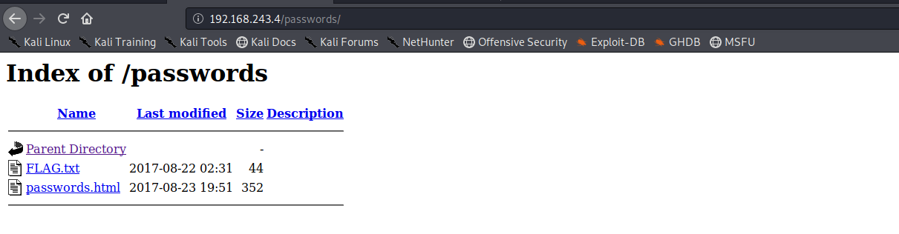 

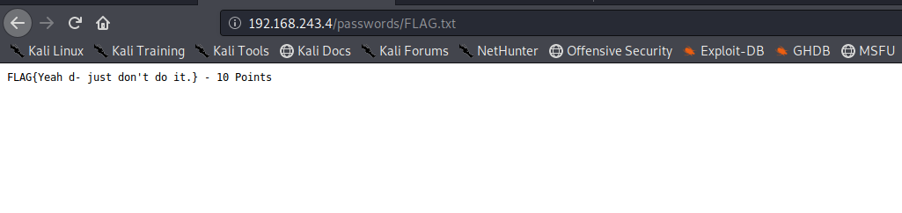 

**flag-3**
```
FLAG{Yeah d- just don't do it.} - 10 points
```
***points=30/130***

Lets checkout the passwords.html file 
nothing interesting it seems

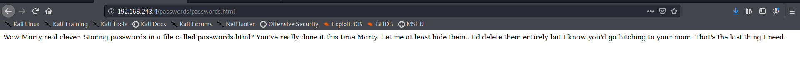 

but its source has a password for us !!

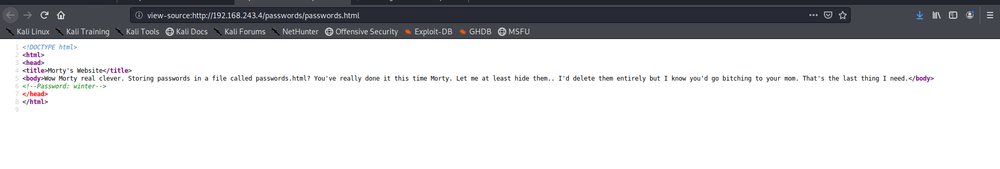 

Lets checkout the *robots.txt* file ,root_shell is not even a bit useful but the tracertool-cgi is vulnerable to command injection 

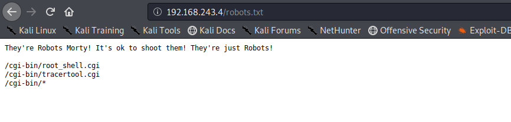 

I found that using cat command showed a picture of cat it the system so i used head and tail to view /etc/passwd
commands used

```
"; head /etc/passwd;
"; tail /etc/passwd;
```

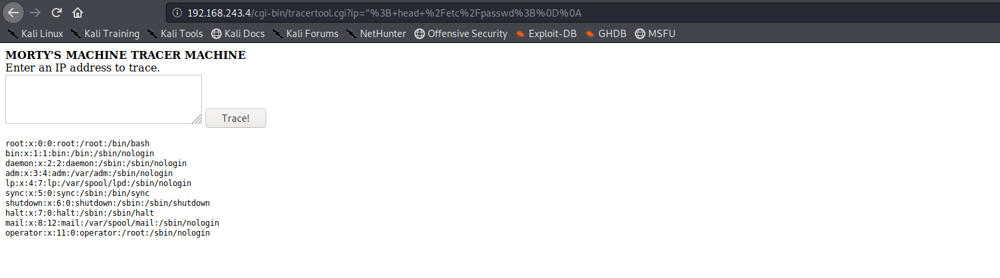 

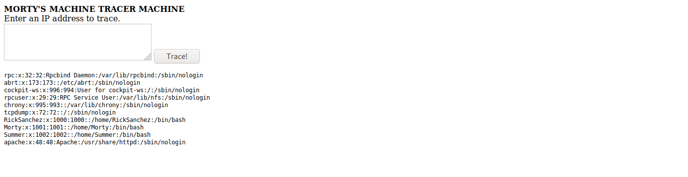 

This shows us that there are 3 users with shell access
*RickSanchez,Summer,Morty*
And the password **winter** would most likely be the password for user *Summer*

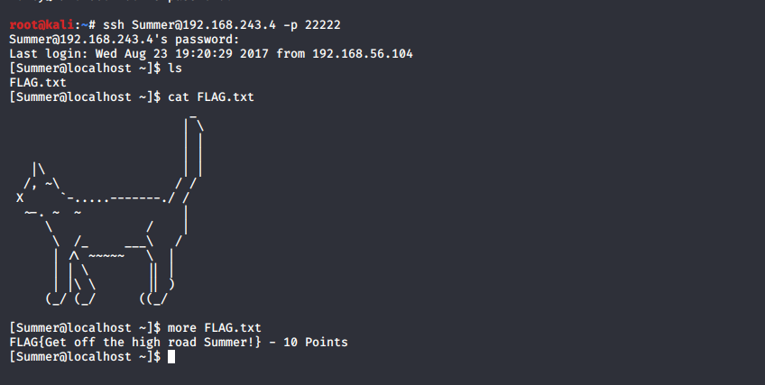 

Bingo!
We got another flag

**flag-4**
```
FLAG{Get off the high road Summer} - 10 points
```
***points=40/130***

Checking out other users' files 
For Morty we have a jpeg image and zip file 
The zip is password protected my best guess was that the password was hidden in the jpg file since strings was not installed in the system I had to use the head command and I got the password as ***Meeseek***
and there was another flag for us

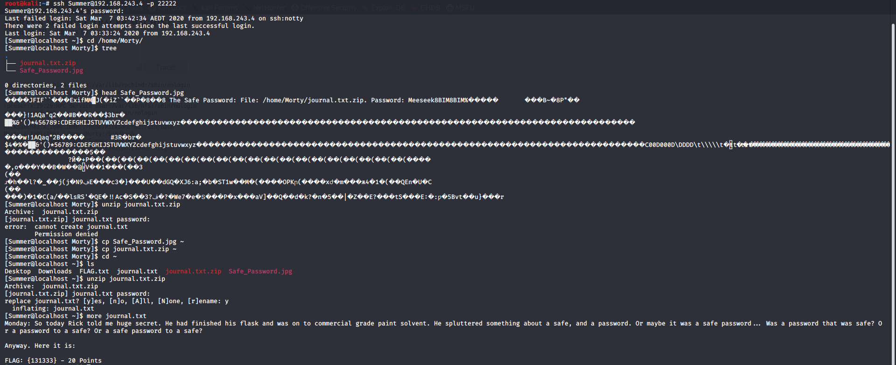 

**flag-5**
```
FLAG{131333} - 20 points
```
***points=60/130***

Now it was time for *RickSanchez*
there was a binary **safe** in the directory on running I found that the binary needed an argument
based on prev flag I entered *131333* as the argument and ***BOOM*** I got another flag

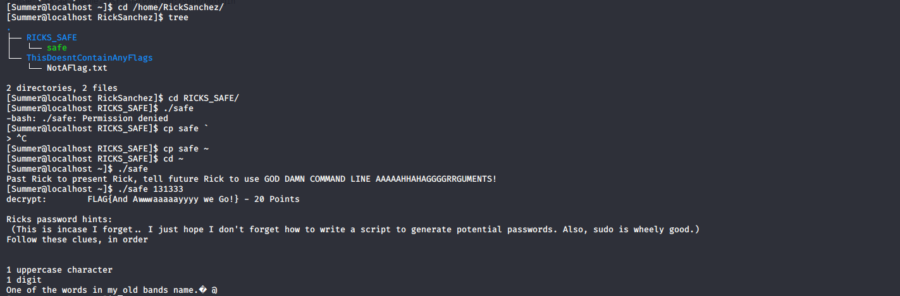 

**flag-6**
```
FLAG{And Awwaaaaayyyy we Go!} - 20 points
```
***points=80/130***

there was also a hint to RickSanchez's ssh password 
the band name was ***The Flesh Curtains***(Found it on Google FYI:Not a RickNMorty Fan)
Now lets generate the bruteforce password list I used crunch 

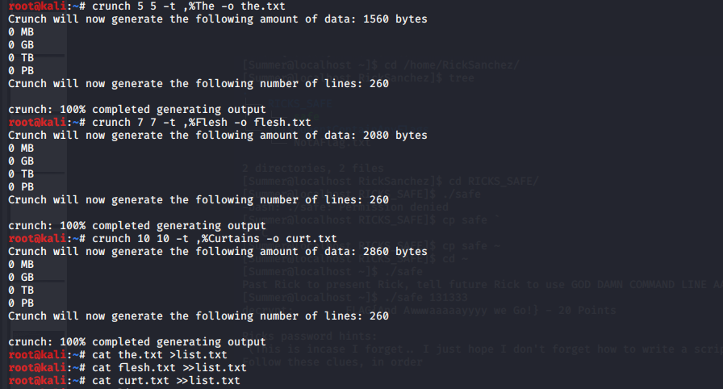 

After generating the wordlist i let it run with hydra and yup i got the pass

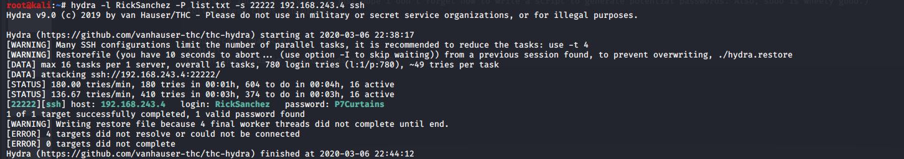 

the pass was **P7Curtains**

On logging in I checked for root privileges 
and elevated to root easily and read the flag

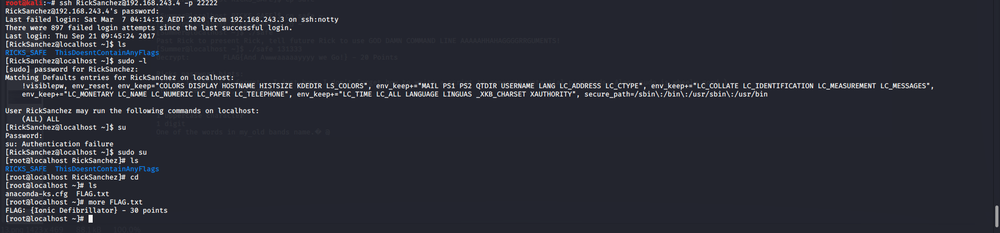 

**flag-7**
```
FLAG{Ionic Defibrilator} - 30 points
```
***points=110/130***

Now lets focus on remaining open ports 
On checking out 9090 
it directly gave us the flag

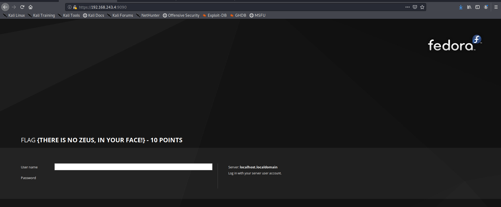 

**flag-8**
```
FLAG{THERE IS NO ZEUS,IN YOUR FACE!} - 10 points
```
***points=120/130***

And now the last port unchecked was 60000 on connecting to it using netcat gave us some kind of shell and i read the flag no worries

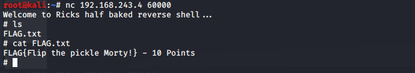 

**flag-9**
```
FLAG{Flip the pickle Morty!} - 10 points
```
***points=130/130***

Yep this was a great box for me as I completed it within a day despite it being my first box as I had read writup about other boxes previouly it helped me a lot 

*BYE!!*