So one time for one more box will complete the tryhackme advent of cyber in coming 2 days just bored of those challenges

so I came across this beginner box on google so though let me walk you through it 
the download link to the box is given below

[box Download](https://drive.google.com/file/d/1yFKVD_bDvzMp66ewOmyihXZ-_RZ8yGOs/view?usp=sharing)

Lets start !!

First step as always is Netdiscover 
So the IP address to attack is **192.168.43.227**

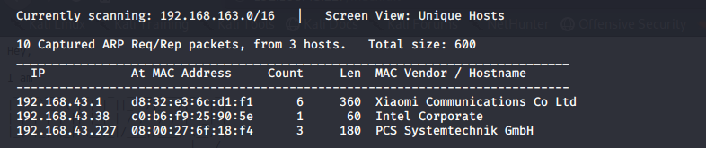

now while running the nmap scan I thought that lets check if there is anything by default at port 80 and yes i was right i got a link to *index.txt* file

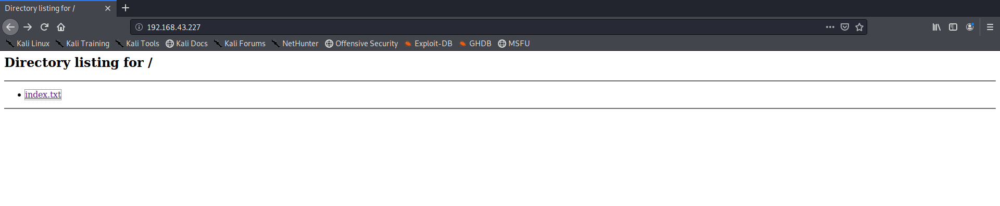

On checking the file it just gave out the tasks to perform in order to root the box 

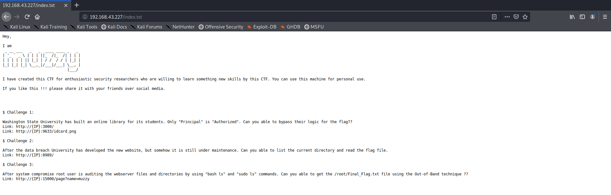

Lets go to the port mentioned in the first task 
We are greeted with the following site

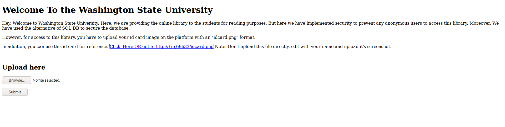

the idcard.png looked something like this 
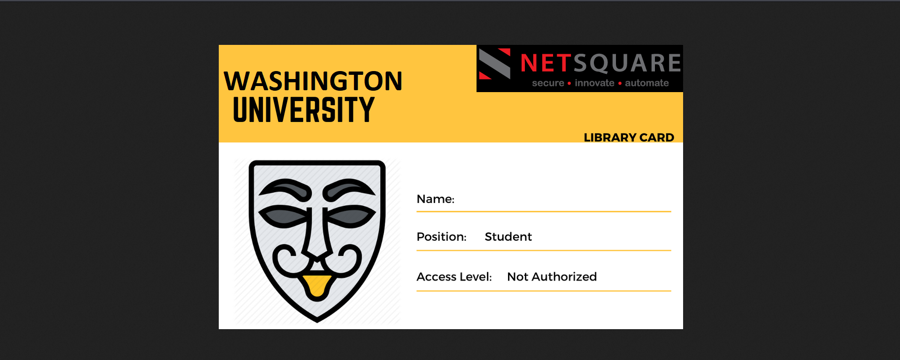

after hours of enumeration and brainfuck(checking for hidden directries using gobuster and then trying nikto and many other recon tools I was so frustated that I went on to watch *Jumanji*)
After a short break I was once again trying what to 
Then I thought of editing the *idcard.png* file as specified on the website and also there was mention of ***nosql*** on the website ,so I went to nosql payload all things [link](https://github.com/swisskyrepo/PayloadsAllTheThings/blob/master/NoSQL%20Injection/Intruder/NoSQL.txt) and copied a given command in the name tag 

And with the help of my great photo editing skills i got this id card

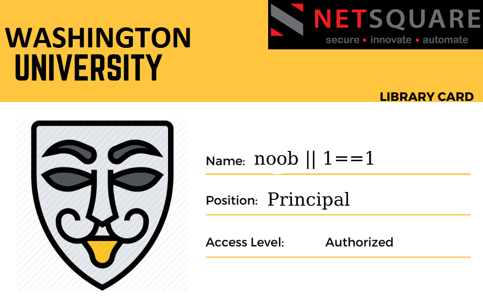

uploading it gave me somewhat of a flag so i]I left it there and moved on to next task as I was frustrated from it

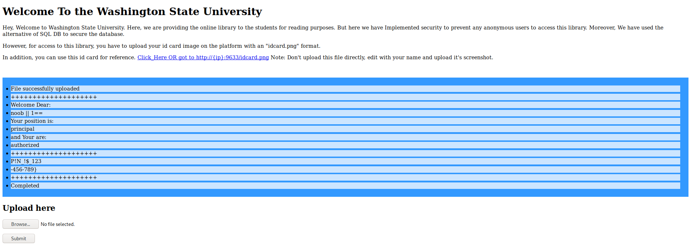

flag1-**P!N_!$_123-456-789}**
I think that trying different payloads would give different results so you can try it !!!

Now moving on to the next task 
visiting the specified url 

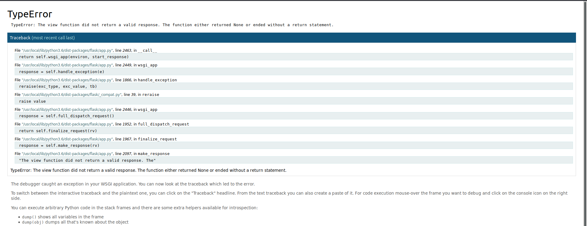

this looked somewhat like a jupyter notebook so trying to access the console to see the file present in the notebook directory when trying to ask for pin, trying ***123-456-789*** which we got in previous flag lets us open the console 
now its basic enumeration

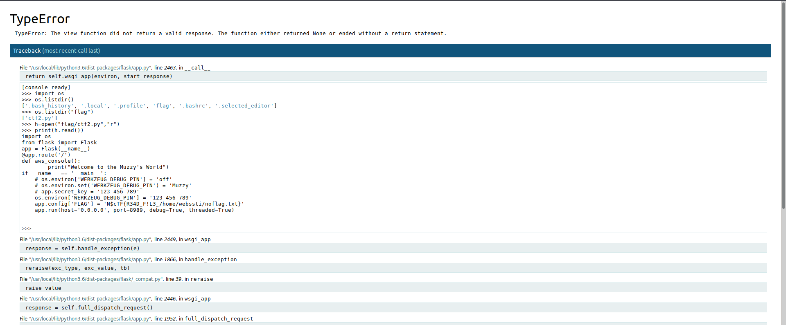

And this is the second flag for us 
flag2-**N$cTF{R34D_F!L3_/home/webssti/noflag.txt}**

based on the flag format the first flag will be
flag1-**N$cTF{*maybe_some_string*+P!N_!$_123-456-789}**

lets move on to third task this was a ***trickier*** one
on visiting the website we see that it prints anythin we supply to **name** parameter

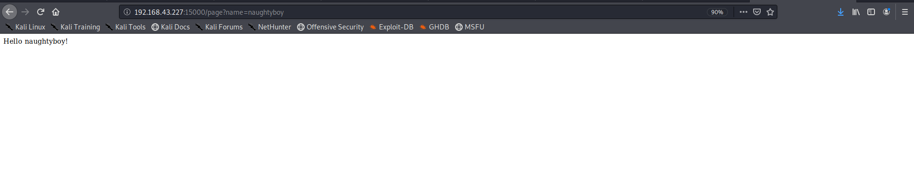

Event php too
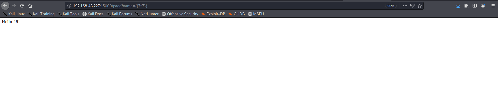

so I searched for php injection tool on github and came across this [tool](https://github.com/epinna/tplmap) 
now I downloaded and set it up 
and ran it and it showed that **name** parameter was vulnerable 

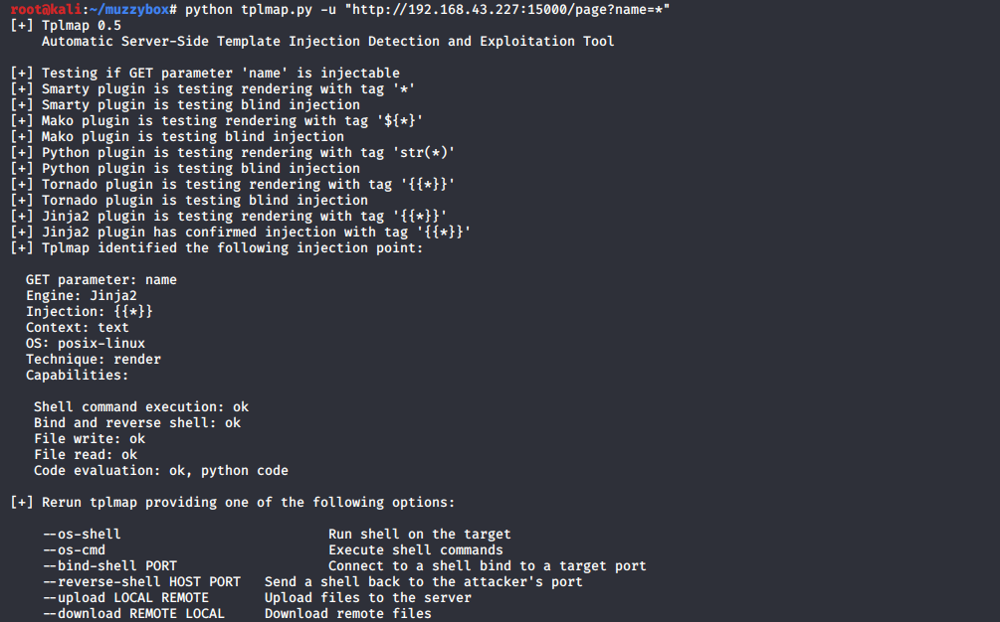

So we can also get a shell so re run the command
We get a shell and read the file specified in the previous flag

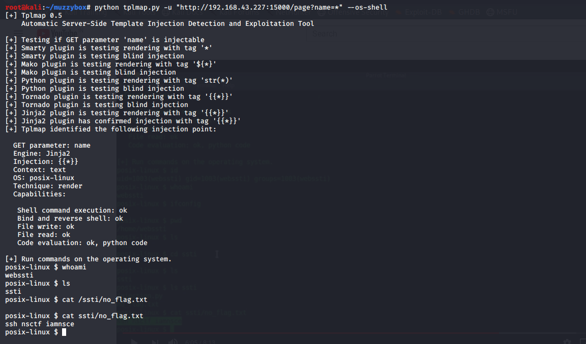

the file contents were about a ssh login creds so loggin in 
lets try the *sudo ls* and *bash ls* commands but it didn't help us checking the path
and permission of **sbin** folder shows that it belongs to nsctf user and root group 
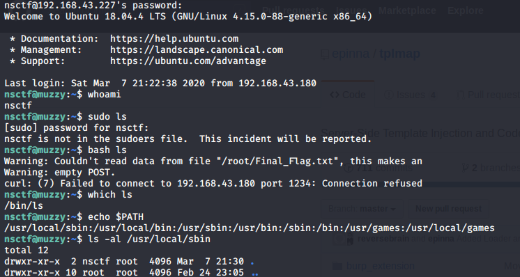

so we can make a file with name ls to read the content of final_flag.txt files whose path is specified in the challenge page and we start up the listener on our side and Bingo!! we got the flag

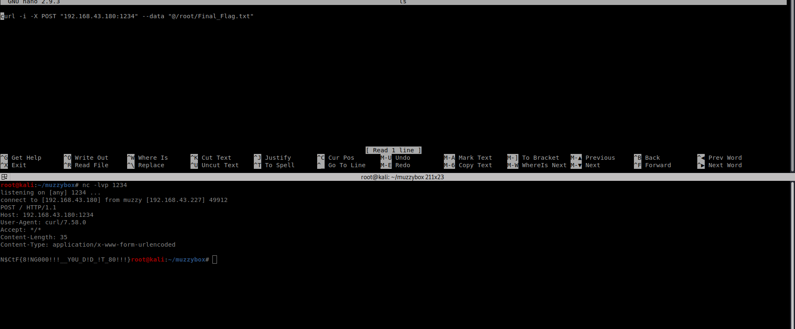

Final flag-**N$cTF{8!NG000!!!__Y0U_D!D_!T_80!!!}**

So yup that was it !!  
I spent 9 hours on this box despite this being a beginner box but at the end 
**Enumeration is the Key**
