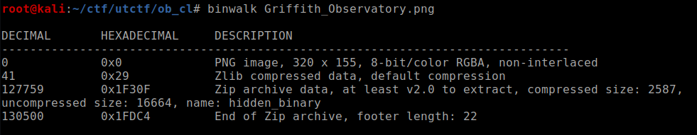
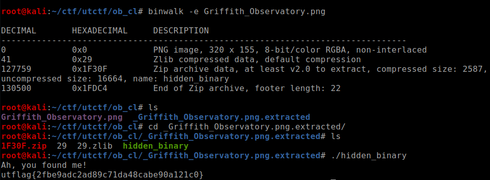
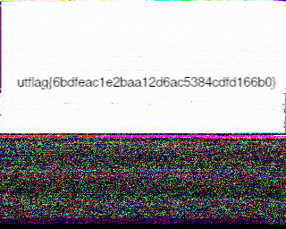
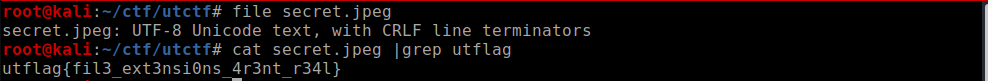
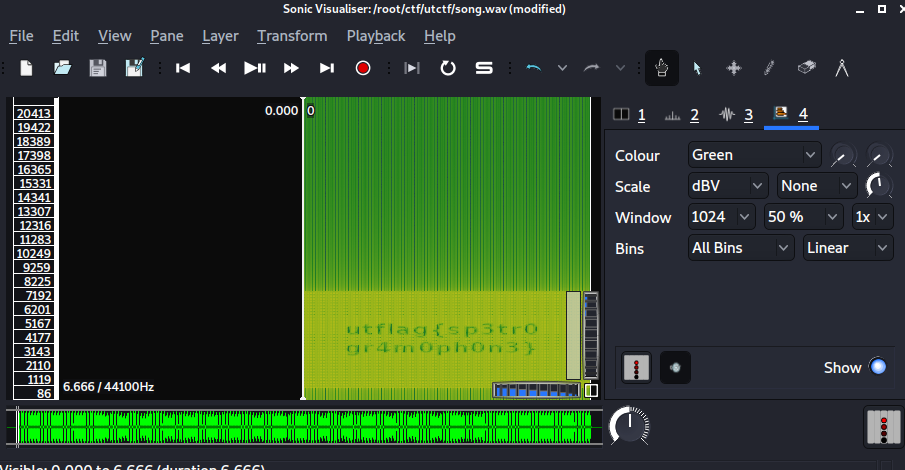
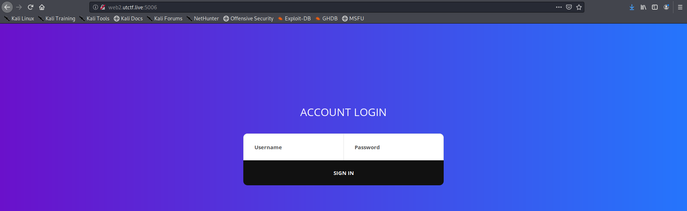
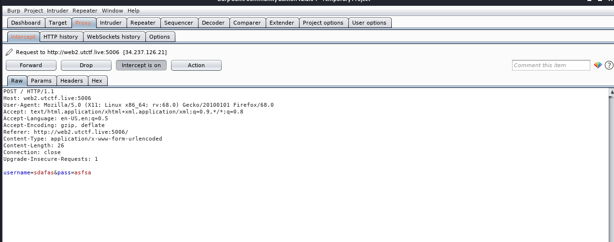
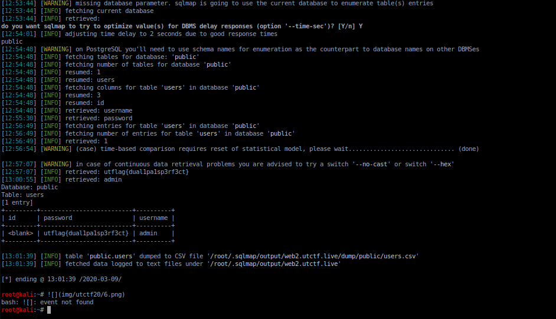
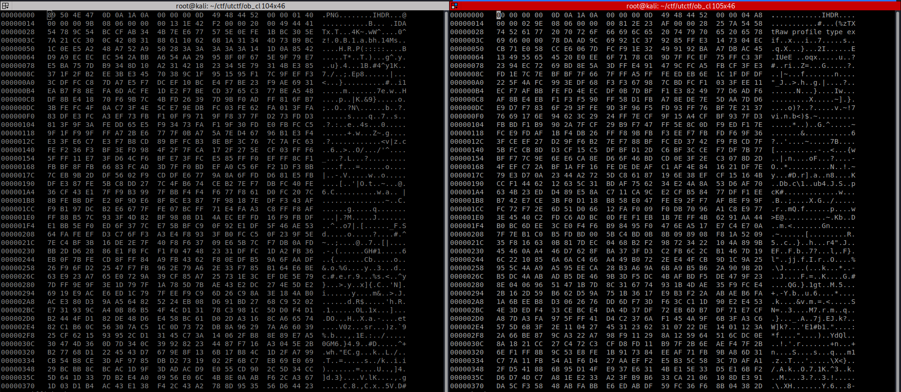
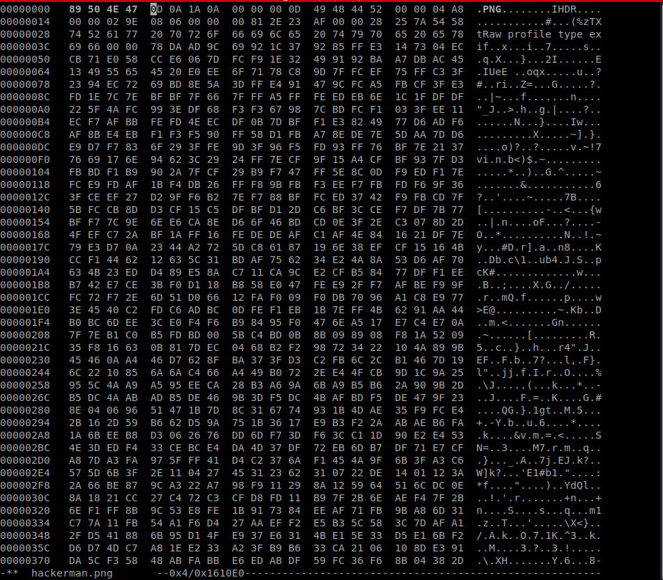

## Observe Closely(Forensics),50 pts

Running strings on the binary shows us a hidden_binary at the end of the png file 
lets run binwalk 

we can confirm that there is indeed a binary hidden inside the file lets extract and run it 

we got the flag!!

## 1 Frame per Minute(Forensics),50 pts

As the SSTV was mentioned in the challenge description 
It was similar to the *moonwalk* challenges in the picoCTF

I used this mobile [app](https://play.google.com/store/apps/details?id=xdsopl.robot36&hl=en_IN) in auto-detect mode and let the audio play and I got the flag

## [basics]Forensics,50 pts

we just check the file type of the file give and it just turns out to be text so we grep for our flag and get the flag

## spectre(Forensics),50 pts

As the name gave the hint ,this must the challenge in which the flag is hidden in the spectrogram of the audio file

firing up Sonic-Visualiser and plotting spectrogram gives us the flag

## epic admin pwn(Web), 50 pts

we are provided with the following login website vulnerable to SQLi

lets intercept the request with burp and use it with burp 

now using sqlmap gets us the pass

## The Legend of Hackerman Pt. 1(Forensics),50 pts

so the png file is corrupted so lets compare the corrupted png with another png file
we see that there is error in magic bytes so lets correct it

now we can easily view the image

