So this is last part of the writup of the 25-day series
Hope you learnt something till now!!!

## Day19(Task 24)

this is a LFI task 
just like we have done in previous task 
so I ran the whoami command and got the response shown below

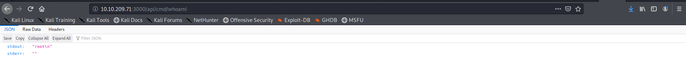

So we are root so lets find where the user.txt file is located note that we have to url encode the command we are going to execute so I used the find command to find the location

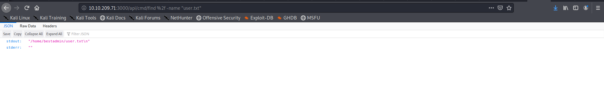

now just simply reading out the user.txt file 
I know that the task was to spawn a revershell using the lfi but I was lazy enough to not do that and find the other way

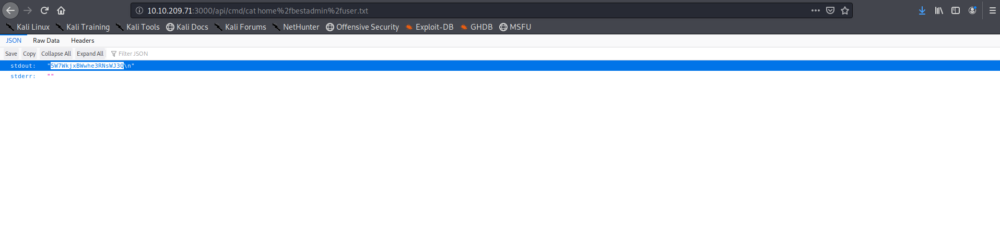

## Day20(Task 25)

We are given with an IP let's start with the basic nmap scan

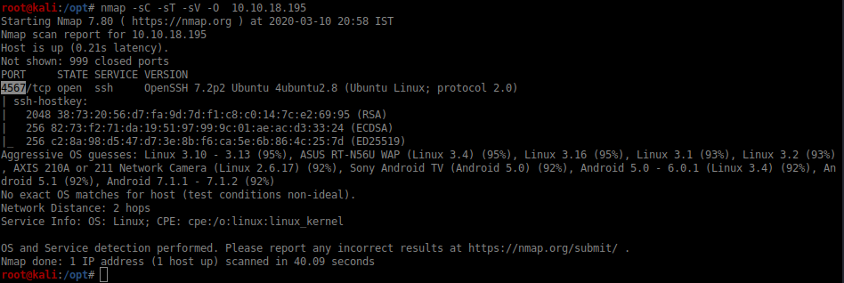

we got the answer to the first question now lets use hydra to bruteforce the user **sam** password

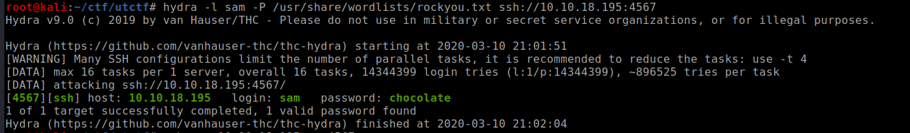

found the password now logging into the machine using ssh and reading the first flag

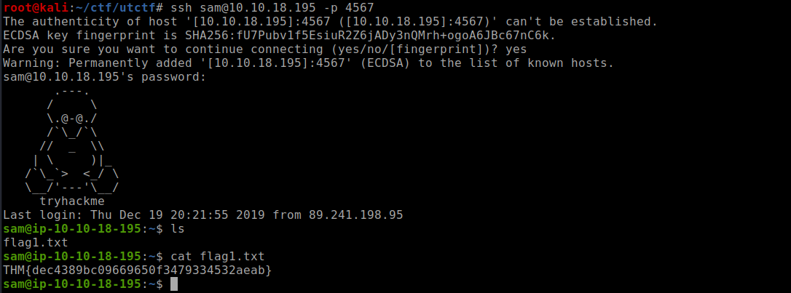

the second part was a cronjob escalation which is kind of easy if you understood the previous challenges carefully

so I am not solving the last part 

## Day21(Task 26)

This is a reversing engineering task 
I am complete noob in this fields so I read about tons of blogs to get started on this
lets begin with analysing the binary with r2 using following command

```
r2 -d <file-name>
```

now we start auto-analysing the binary with the command ***aaaa***

Now search for the main function as referred in the helping material using 
```
afl |grep "main"
```

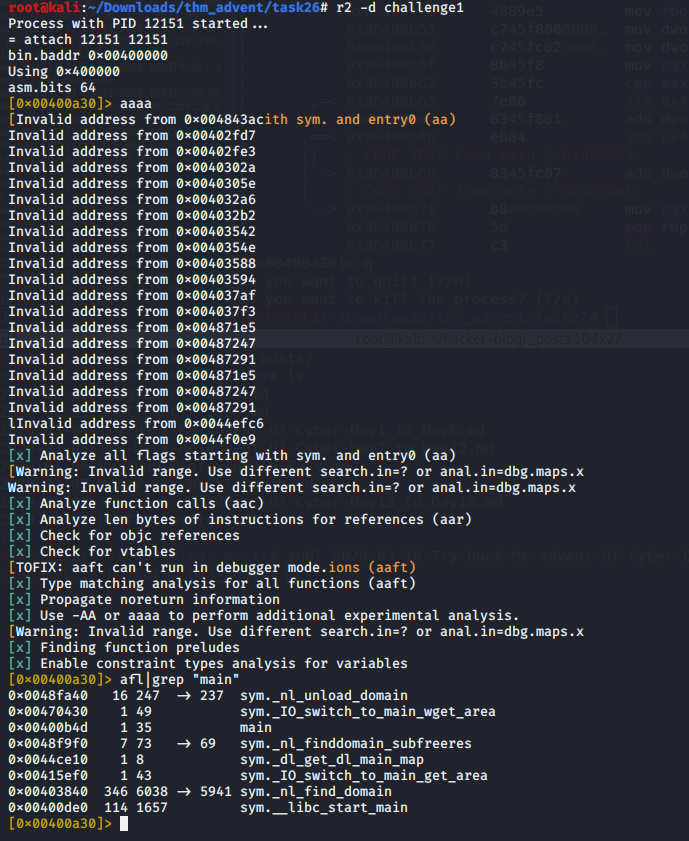

now to view the disassembled assembly code for main function we use 
``` pdf @main ```

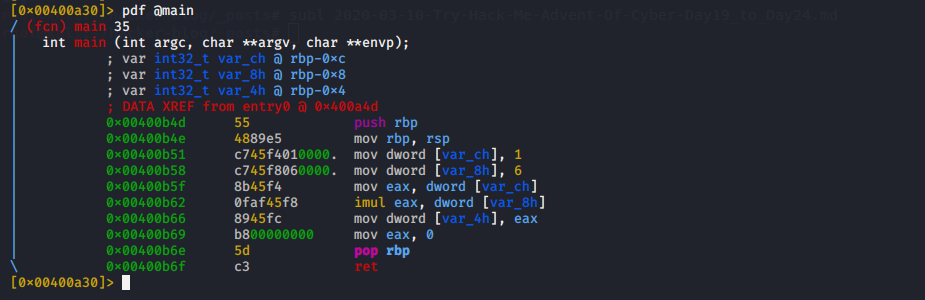

here we can see the disassembled code and I don't need to explain you in detail all of the things are given in helping material

now lets add breakpoints  by using following commands
```
db <address>
```

to add a breakpoint

then we use the commands to control the execution flow
**dc**- continue exection 
**ds**- go one step ahead into the program flow

you can see the breakpoints i added 

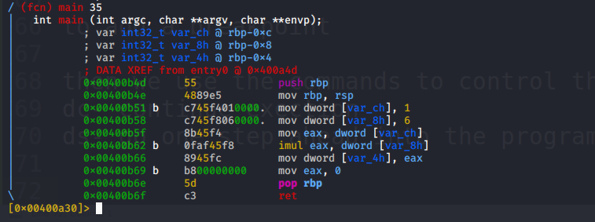

now checking the value of var_ch at intialization
we see that the value of var_ch is still not initialised so we step one instruction further and view its value by using ``` px @<location> ```

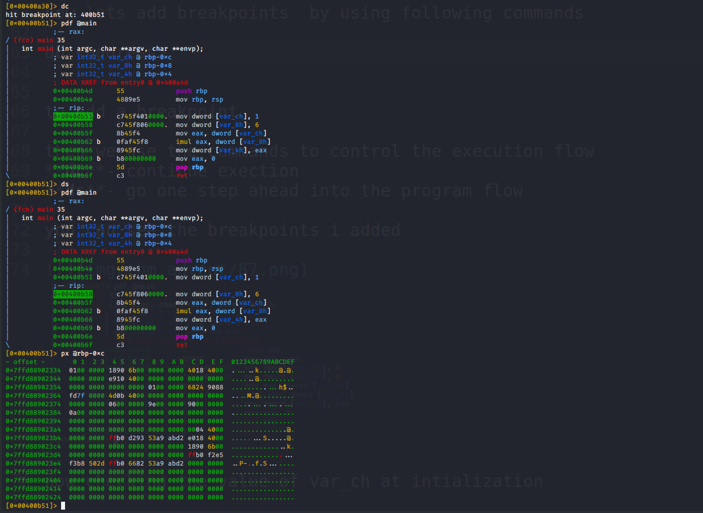

We got the answer to first question now continuing
now we have to check the values of the register so we use ``` dr ``` command

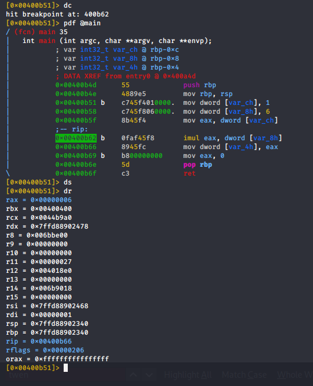

We got the answer to the second question as well so lets continue
now we to check the value of *var_4h* before the eax register has 0 assigned to it

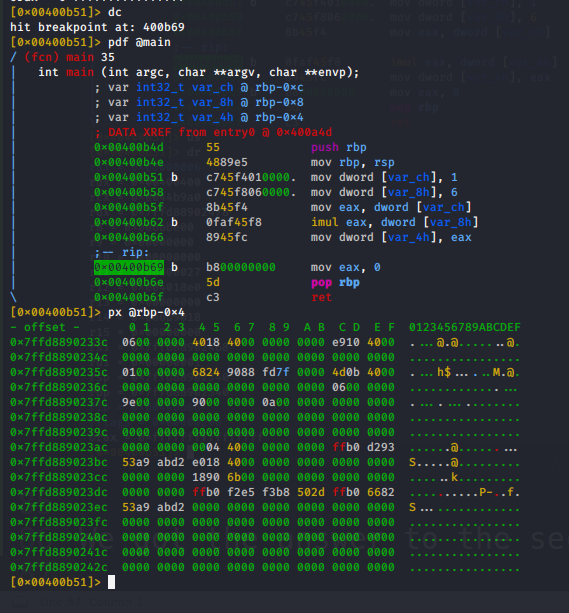

we get the answer to the third question as well 
That's all for this task

## Day22(Task 27)

This is also a reversing task but this is used to explain the implementation of the conditional statements in the assembly code 

lets view the decompiled code of the main function

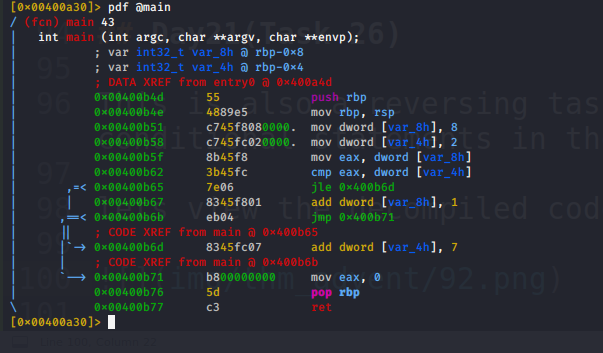

the C language equivalent code would be something like this

```c
a=8
b=2
if(a<b){
	b+=7
}
else{
	a+=1
}
```

from the above code we can easily answer the questions asked in the task

## Day23(Task 28)

So this a SQL-injection task
And I have previously used the sqlmap tool in previous task so I dont need to explain it again

lets take al look at the website,just a basic login form


lets start up burp and capture the request to be supplied to splmap
and check for the databases present with sqlmap

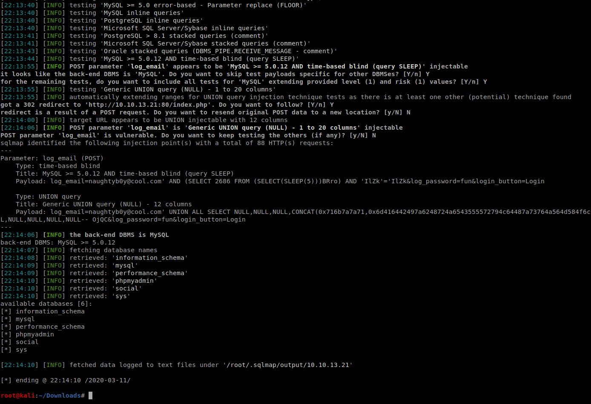

so the database name is **social** and lets check for tables

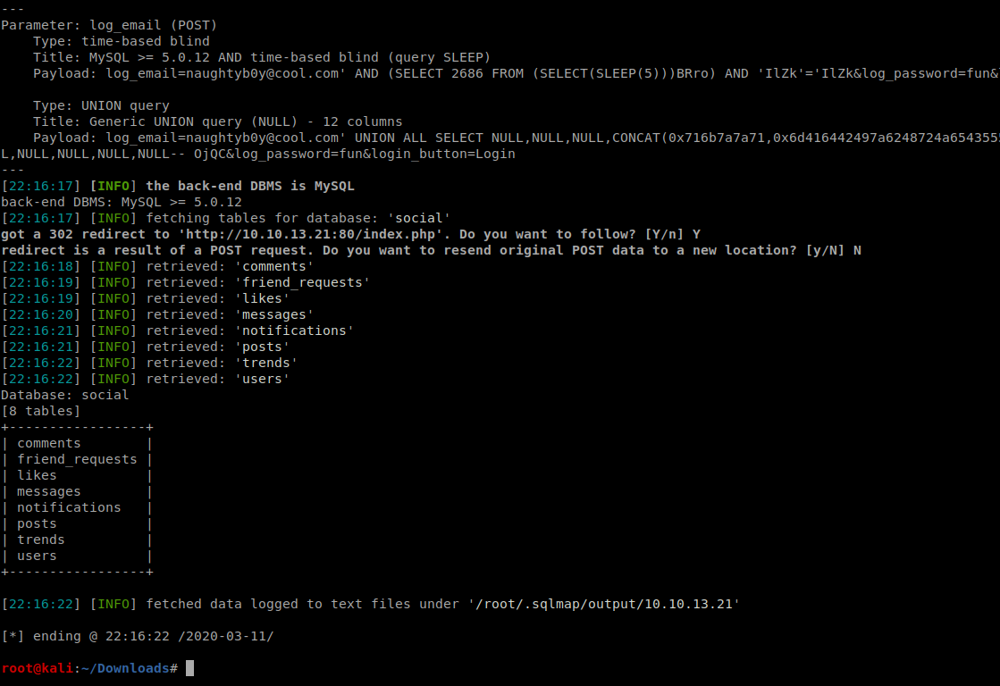

so looks like the table is **users** so lets dump the data present in the table

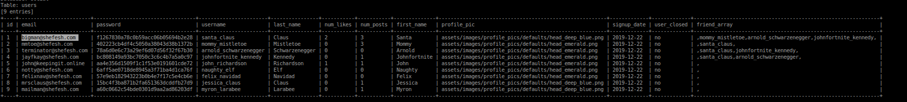

so we got the email for santa claus ie **bigman@shefesh.com**and the password as md5 hash so lets crack it online

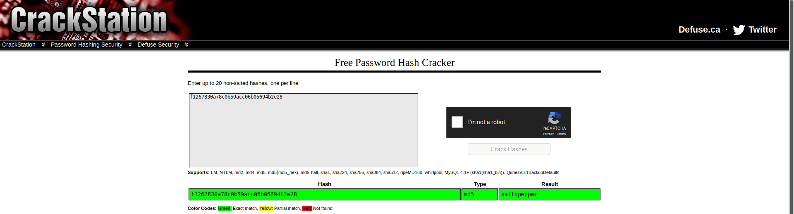

lets login into the website
we can easily view the conversation between santa and Mommy Mistletoe

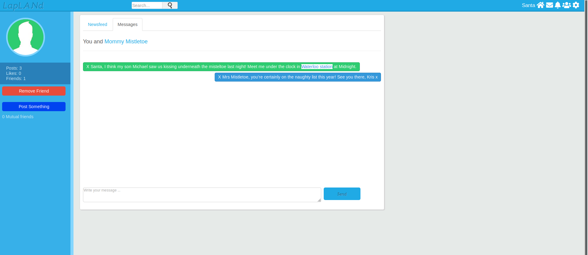

to get a shell we have to upload php revshell to the site 
so we can post the php file to website but we cant upload it directly as it restricts it so we rename the file as .phtml and it lets us upload it and simultaneously start a listner at the port specified in the file 

so we get a shell and access the flag

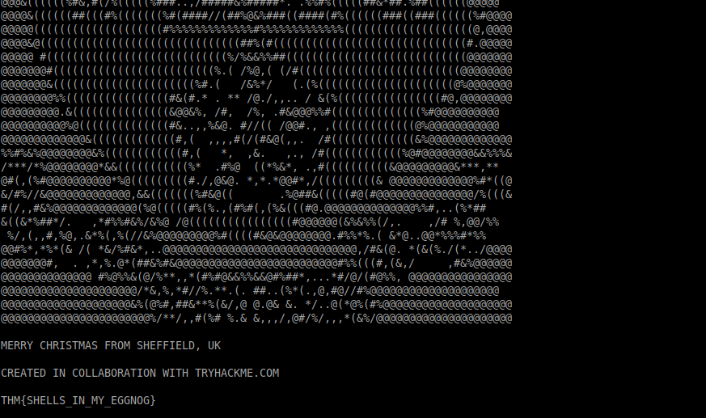


## Day24(Task 29)

lets start with an nmap scan

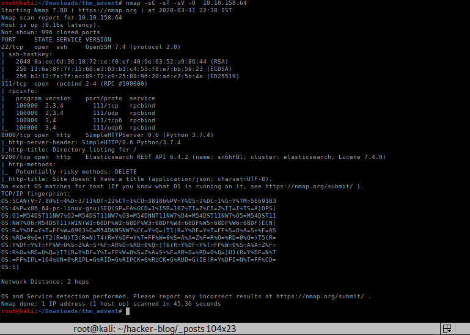

so lets checkout the 9200 port elastiseach service 
i got a useful [article](https://logz.io/blog/elasticsearch-queries/) on same

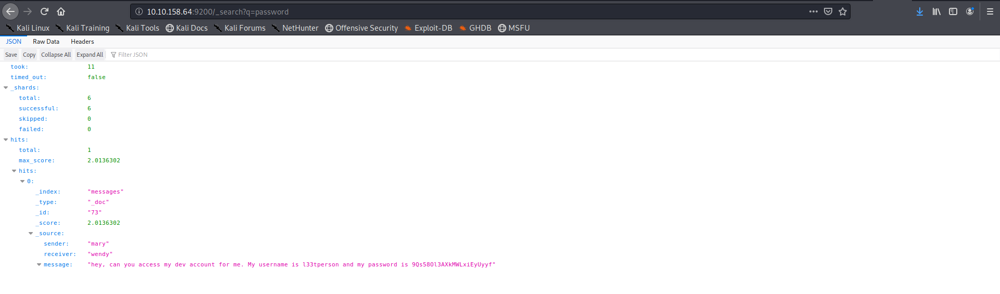

lets checkout the port 8000
its turns out to be a logfile so lets take a look at it 

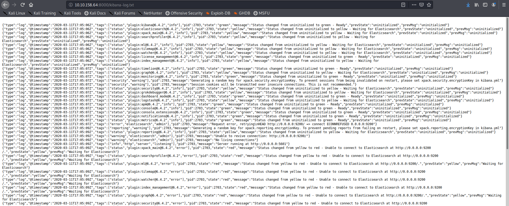

so it seems that there seems to be a server running at 5601
so lets verify it with nmap and it seems to be true

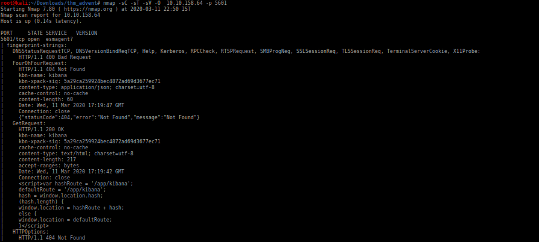

lets visit the port

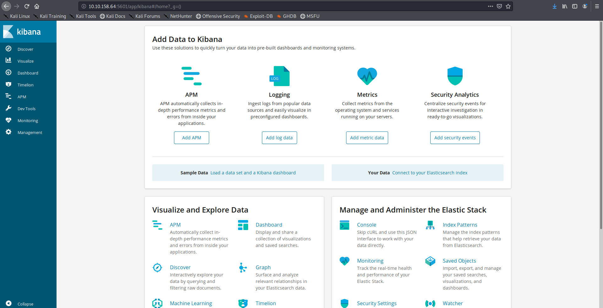

lets search for the kibana version number

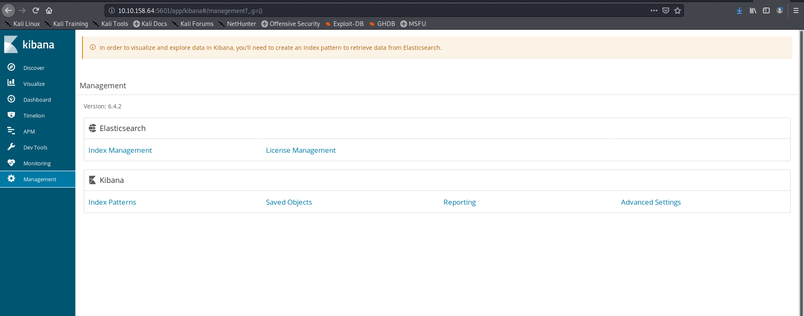

On search about vulnerablities related to this version i found [this](https://www.cvedetails.com/cve/CVE-2018-17246/) and also [this](https://www.cyberark.com/threat-research-blog/execute-this-i-know-you-have-it/)

lets try it 

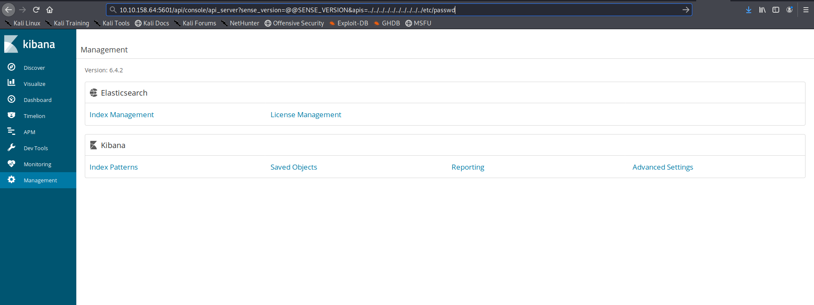

we can see the contents of /etc/passwd in the log file

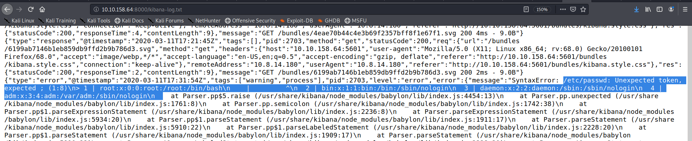

so lets try to view the root.txt file 

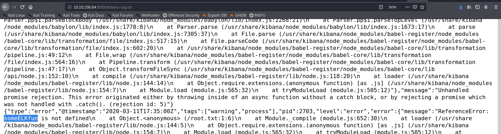

Hurray we got the flag lets submit it and I completed the 25 day series
This series was very interesting and got to learn a lot 

Day 25 has **no task** so this ends the writup


