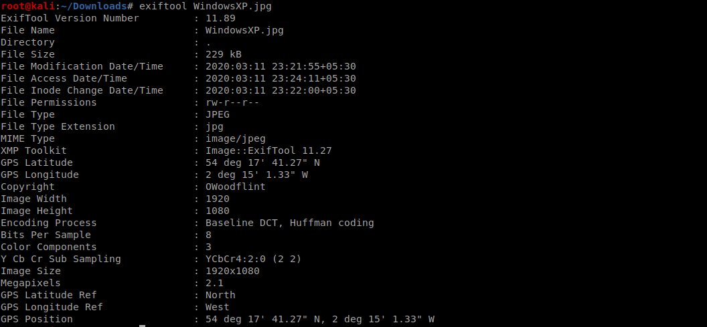
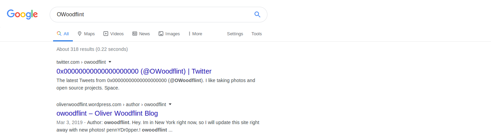
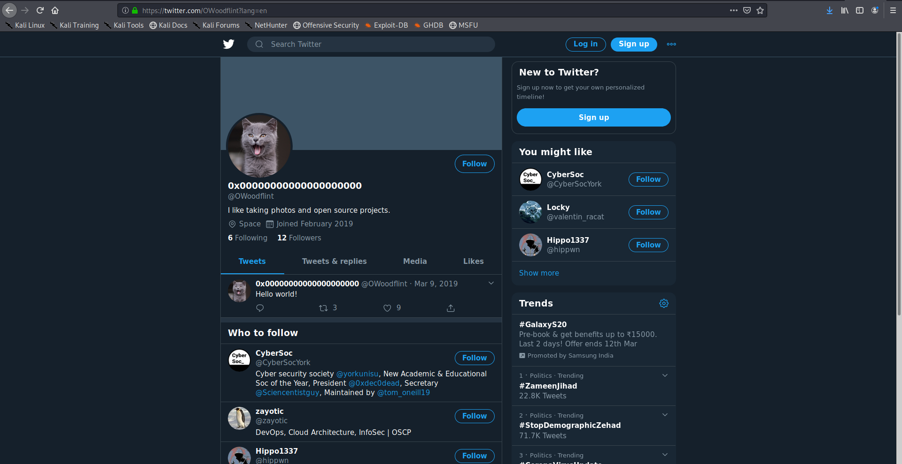
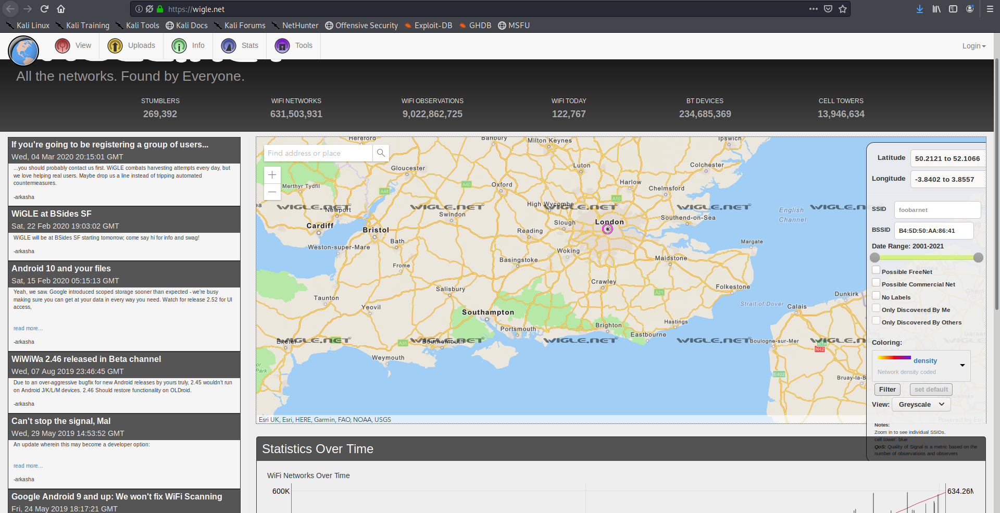
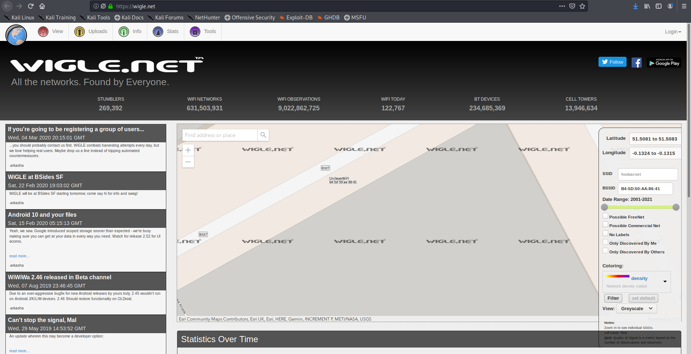
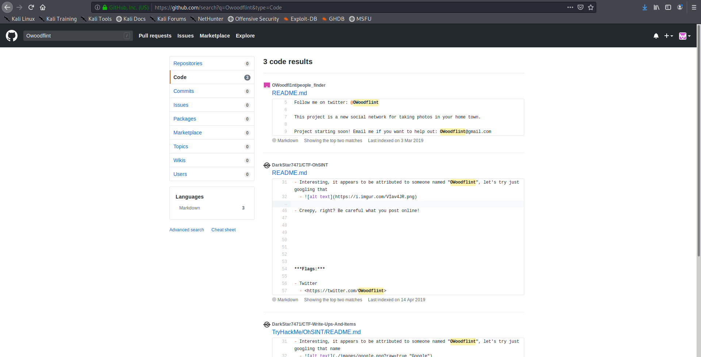
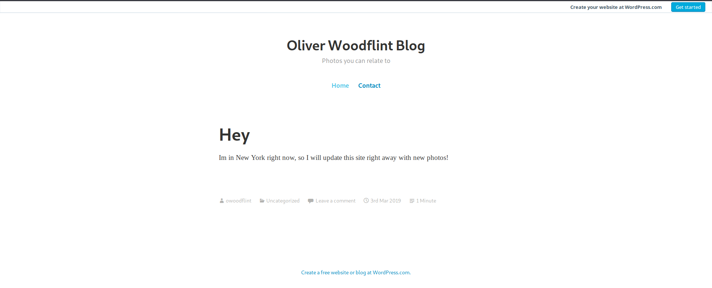
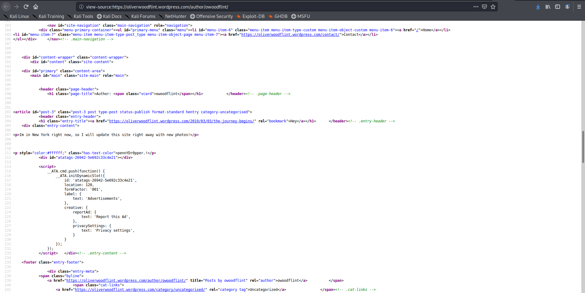

this is the writup for the [room](https://tryhackme.com/room/ohsint) on try hackme

lets start !!
we are given with an image 

lets see what exiftool gives us 

So we got a username - **OWoodflint**

lets search for it using sherlock.py and we got that there is a twitter account with this username

lets search google with this username

so there is a Wordpress blog as well lets checkout the twitter account first

we get the answer to first question

there is also a bssid mention by him in a tweet lets geolocate it
I found that [this](wigle.net) is useful

So we find that our target lives in London

On infitely zooming in I find the ssid
its **UnileverWifi**

after a lot of digging I could not find the email so I though of checking github as there might be some repo with the username and yes I got the email

for the 6th question its straight forward we can get it by looking at his blog

for the last question we had to find the password of the person so I searched his twitter account but got nothing so I looked deep into his blog and got the password in the source code

and yup another room solved I found this quiet easy as it was basic recon but practice is always good :)

