So I am back with another writup
this is the [link](https://tryhackme.com/room/boilerctf2)

I started with a quick scan with nmap and got this


The ports open are **21,80,10000**

So we checkout the http page on port 80

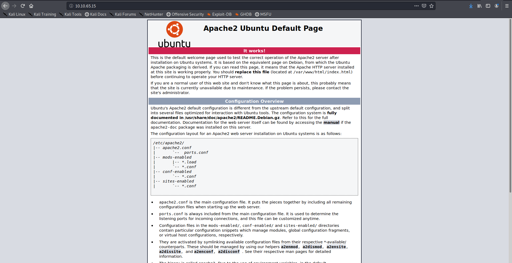

It doesn't contain anything useful lets check port 10000
it uses ssl so make sure to use **https:** instead of **http:**

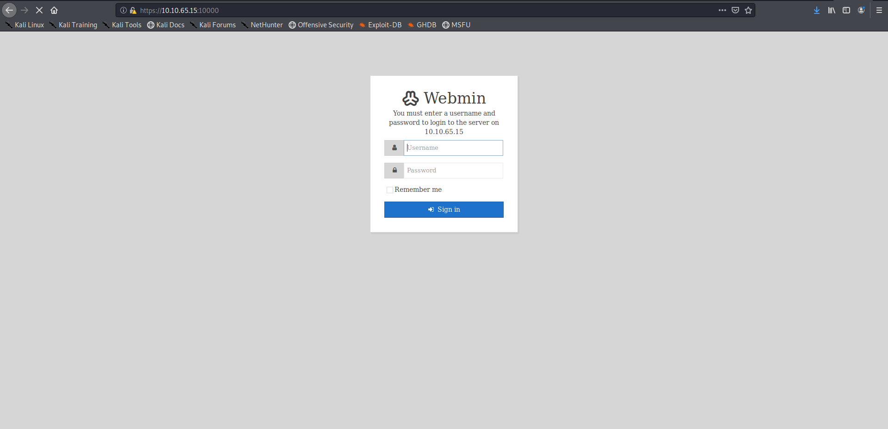

I searched for vulnerability related to this Webmin version But I didn't find anthing useful so 
there is a question related to finding the service on the highest port so I ran a quick scan(it still took 10 mins) for the higher ports and found a port open

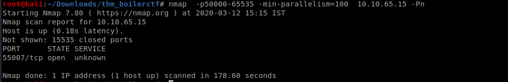

On looking deeper into the port I find that ssh is running at this port so 
we have to find ssh creds 

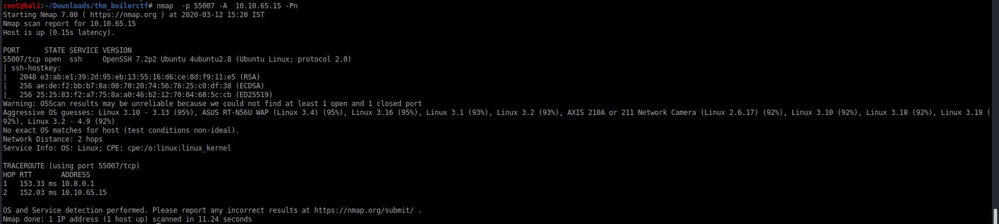

I forgot to look at ftp port so lets see if anonymous login is possible

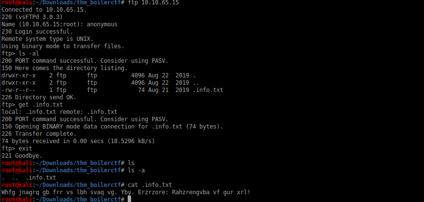

yes and we find a file lets read it ,It look like a caesar cipher using an online tool I got the message

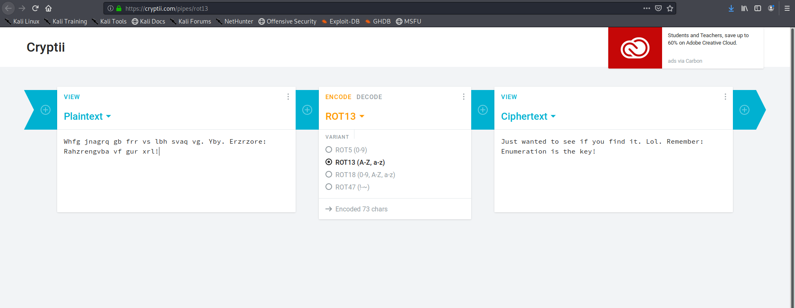

Very encouraging words in the message ,at this time I had no clue how to get the login creds so I ran the gobuster for hidden directories

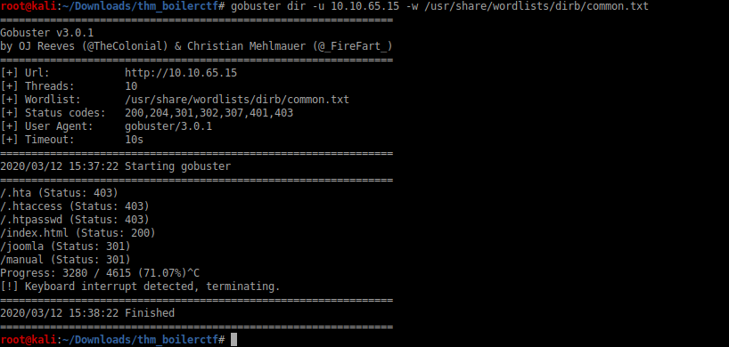

So the server is using  **Joomla** CMS
Again running gobuster on the joomla directory

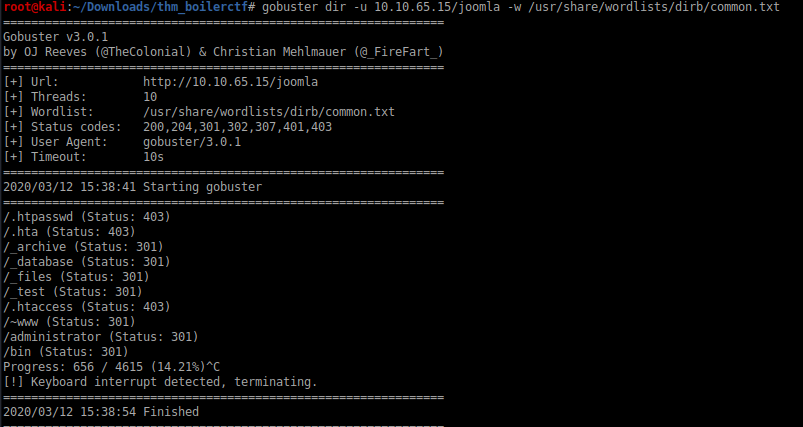

Visiting some of the pages its some cipher its just there to troll me 
I was frustated to see the message I got after visiting some of the pages 
so I didn't share the message in them

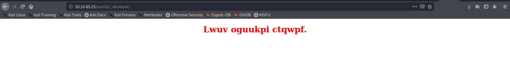

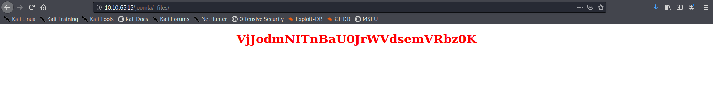

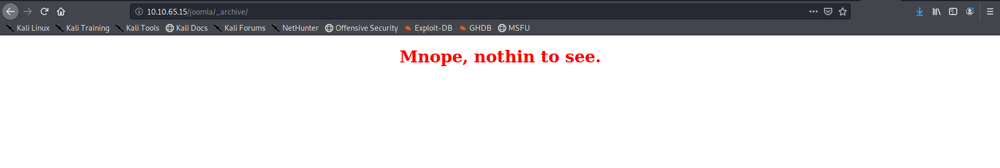

On checking *_test* i got the following page

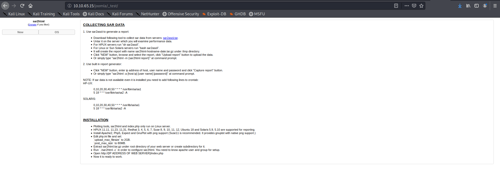

searching for vulnerablity related to it I got [this](https://www.exploit-db.com/exploits/47204)
So it seems that there is RCE in the url so lets see the log file if we can 

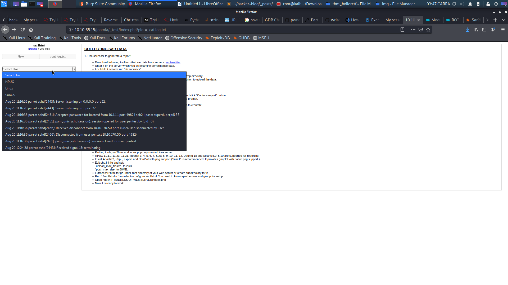


So we find some creds 

```basterd:superduperp@$$```

lets login !!

We can find the pass word for stoner 

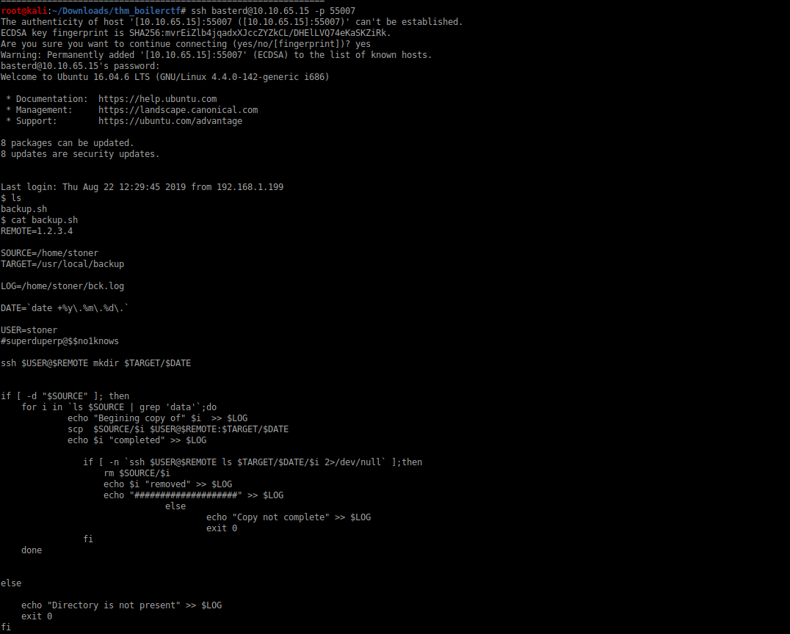

lets see what is there in stoner's home directory
there is the user.txt flag for us but its name in the machine is secret

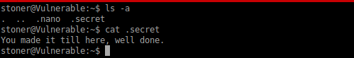

lets find the location of root.txt
we find the location at /root/root.txt

lets try if we can exploit find first 
and we can so we use the following command to get the flag
```find / -exec cat /root/root.txt \;```

you will have to stop the command or it will continue till the infinity

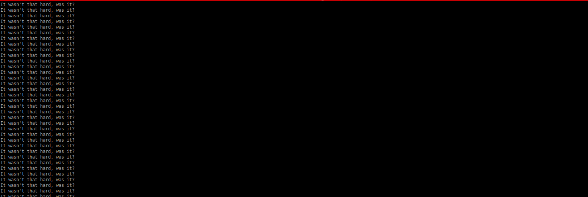

So this is the final flag
Hope you learnt something! **:)**